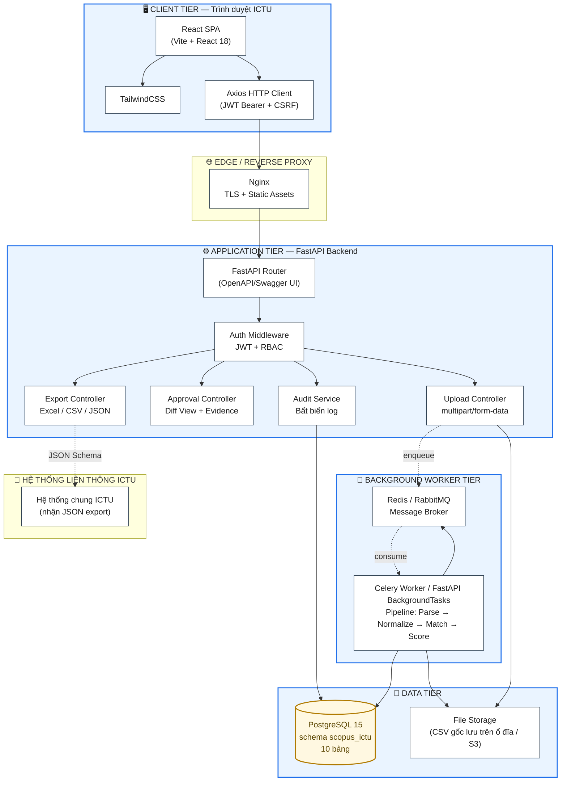

# TIẾN ĐỘ TUẦN 3: THIẾT KẾ CƠ SỞ DỮ LIỆU QUAN HỆ

> **Đề tài:** Xây dựng ứng dụng web quản lý và chuẩn hóa hồ sơ tác giả, công bố khoa học trên Scopus phục vụ Trường Đại học Công nghệ thông tin và Truyền thông (ICTU).
> **Tuần thực hiện:** Tuần 3 — Nhiệm vụ 1: Thiết kế CSDL quan hệ (ERD + Data Dictionary + SQL DDL).
> **Căn cứ:** Đặc tả FR/NFR Tuần 2 (`BAO_CAO_TIEN_DO_TUAN_2.md`); Kết quả khảo sát 660 bản ghi Tuần 1 (`scopus-ictu-data-survey.md`); Chuẩn PostgreSQL 15.
> **Quy ước đặt tên:** `snake_case` cho toàn bộ tên bảng và cột; khóa chính (PK) là cột `id` (BIGSERIAL); khóa ngoại (FK) có hậu tố `_id`; tất cả bảng đặt trong schema `scopus_ictu`.
> **Người soạn:** Trương Quang Huy — SV ngành CNTT, ICTU.

---

## 1. TỔNG QUAN THIẾT KẾ CƠ SỞ DỮ LIỆU

Hệ thống Scopus ICTU cần lưu trữ toàn bộ dữ liệu từ khi nhập tệp CSV thô (22 trường theo khảo sát), qua các giai đoạn xử lý pipeline (parse, chuẩn hoá, Match Score), đến khi Admin phê duyệt và kết xuất báo cáo. Bên cạnh dữ liệu nghiệp vụ, hệ thống còn phải đảm bảo **khả năng kiểm toán bất biến** (NFR-02) và **lưu vết truy cập trái phép** (NFR-04). Từ đó, CSDL được thiết kế gồm **10 bảng** chia thành ba nhóm chức năng.

### 1.1. Phân nhóm bảng

| Nhóm | Bảng | Mục đích |
|---|---|---|
| **Quản trị & Bảo mật** | `users`, `upload_batches` | Quản lý tài khoản, phân quyền RBAC (NFR-04); theo dõi lô nhập dữ liệu |
| **Nghiệp vụ chính** | `raw_scopus_data`, `lecturers`, `author_extracted`, `approval_queue`, `standardized_data` | Pipeline 4 giai đoạn: nhập → bóc tách → phê duyệt → chuẩn hoá |
| **Kiểm toán & Truy vết** | `audit_log`, `export_audit_log`, `security_audit_log` | Lưu vết bất biến theo NFR-02 và NFR-04 |

### 1.2. Nguyên tắc thiết kế chính

- **Idempotency (NFR-01):** Bảng `raw_scopus_data` có cột `eid` UNIQUE NOT NULL — đảm bảo re-import cùng một tệp CSV không sinh bản ghi mới; 660/660 bản ghi thực tế đều có EID đầy đủ theo khảo sát Tuần 1.
- **Khóa định danh chính xác:** Bảng `lecturers` có cột `scopus_author_id` UNIQUE — khớp với 100% Author ID có trong dữ liệu thực tế.
- **Lưu vết bất biến (NFR-02):** Bảng `audit_log` được thiết kế chỉ-INSERT; quyền UPDATE/DELETE bị revoke trên role `app_backend` của PostgreSQL.
- **Phục vụ rollback (FR-20):** Cột `approved_at` ở `approval_queue` và `standardized_data.is_invalidated` hỗ trợ quy tắc rollback ≤ 72 giờ.
- **Cờ cảnh báo dữ liệu thực tế:** Hai cờ `is_retracted`, `is_erratum` ở `approval_queue` để cảnh báo 4 bản ghi đặc biệt (2 Retracted + 2 Erratum theo khảo sát Tuần 1) — không cho phép Phê duyệt.
- **Hỗ trợ fuzzy match (FR-11):** Index GIN kết hợp `pg_trgm` trên `lecturers.full_name_no_diacritics` để tăng tốc RapidFuzz.

---

## 2. SƠ ĐỒ ERD (ENTITY-RELATIONSHIP DIAGRAM)

Sơ đồ dưới đây mô tả **10 bảng** với các quan hệ một–nhiều (`||--o{`) và nhiều–một tùy chọn (`}o--o|`), được vẽ bằng cú pháp Mermaid `erDiagram` để nhúng trực tiếp vào tài liệu.

**[Chèn Hình 3.1: Sơ đồ ERD — Hệ thống Chuẩn hóa Hồ sơ Scopus ICTU]**

```mermaid
erDiagram
    raw_scopus_data ||--o{ author_extracted : "1 bài → N tác giả bóc tách"
    raw_scopus_data ||--o{ approval_queue : "1 bài → N dòng queue"
    author_extracted }o--|| lecturers : "N tác giả → 1 ứng viên GV"
    approval_queue   }o--o| lecturers : "N queue → 0..1 ứng viên gợi ý"
    approval_queue   ||--o| standardized_data : "1 queue → 0..1 dòng chuẩn hoá"
    standardized_data }o--|| lecturers : "N chuẩn → 1 GV ICTU chính thức"
    standardized_data ||--o{ audit_log : "1 chuẩn → N vết kiểm toán"
    export_audit_log }o--o| users : "0..1 người xuất"

    raw_scopus_data {
        bigserial id PK
        text eid UK
        text title
        text authors
        text author_ids
        smallint year
        integer cited_by
        text doi
        text publisher
        text document_type
        boolean duplicate
        text_array warning_reasons
        varchar processing_status
    }

    lecturers {
        bigserial id PK
        varchar lecturer_code UK
        text full_name
        text full_name_no_diacritics
        text scopus_author_id UK
        text affiliation
        varchar faculty
        boolean is_active
    }

    author_extracted {
        bigserial id PK
        bigint raw_id FK
        smallint author_index
        text normalized_name
        bigint lecturer_id FK
        numeric match_score
        jsonb evidence_payload
        boolean is_common_name
    }

    approval_queue {
        bigserial id PK
        bigint raw_id FK
        bigint author_extracted_id FK
        bigint lecturer_id FK
        varchar status
        numeric match_score
        jsonb evidence_payload
        boolean is_retracted
        boolean is_erratum
        timestamp approved_at
    }

    standardized_data {
        bigserial id PK
        bigint approval_queue_id FK_UK
        bigint lecturer_id FK
        numeric match_score
        jsonb evidence_payload
        timestamp approved_at
        boolean is_invalidated
        timestamp invalidated_at
    }

    audit_log {
        bigserial id PK
        varchar action
        bigint actor_id FK
        varchar target_table
        bigint target_id
        jsonb before_json
        jsonb after_json
        uuid correlation_id
        timestamp created_at
    }

    export_audit_log {
        bigserial id PK
        varchar file_format
        jsonb filter_criteria_json
        integer row_count
        char file_hash_sha256
        bigint actor_id FK
    }

    security_audit_log {
        bigserial id PK
        bigint actor_id FK
        varchar attempted_endpoint
        varchar required_permission
        smallint http_status
        inet ip_address
    }

    users {
        bigserial id PK
        varchar username UK
        varchar password_hash
        varchar role
        boolean is_active
    }

    upload_batches {
        bigserial id PK
        text file_name
        bigint operator_id FK
        integer total_rows
        uuid correlation_id UK
        varchar processing_status
    }
```

### 2.1. Thuyết minh các quan hệ chính

| Quan hệ | Loại | Ý nghĩa nghiệp vụ |
|---|---|---|
| `raw_scopus_data → author_extracted` | Một–Nhiều | Một bài báo có nhiều tác giả (trung bình 3–5, có bài ≥ 14 theo khảo sát) |
| `raw_scopus_data → approval_queue` | Một–Nhiều | Mỗi bài sinh nhiều dòng trong hàng đợi duyệt (1 dòng / 1 tác giả) |
| `author_extracted → lecturers` | Nhiều–Một (tùy chọn) | Nhiều tác giả Scopus có thể ánh xạ về 0 hoặc 1 GV ICTU |
| `approval_queue → lecturers` | Nhiều–Một (tùy chọn) | Queue có thể chưa gán được GV nào khi score < 50% |
| `approval_queue → standardized_data` | Một–Một (tùy chọn) | Mỗi queue sau khi duyệt sinh tối đa 1 dòng chuẩn hoá |
| `standardized_data → audit_log` | Một–Nhiều | Một bản ghi chuẩn có thể có nhiều vết kiểm toán (APPROVE, ROLLBACK...) |

---

## 3. TỪ ĐIỂN DỮ LIỆU (DATA DICTIONARY)

Từ điển dữ liệu dưới đây mô tả chi tiết **10 bảng** gồm: tên trường, kiểu PostgreSQL, khóa chính (PK), khóa ngoại (FK) và ý nghĩa nghiệp vụ.

### 3.1. Bảng `users` — Tài khoản người dùng

| Cột | Kiểu PostgreSQL | Ràng buộc | Ý nghĩa |
|---|---|---|---|
| `id` | `BIGSERIAL` | PK | Khóa chính tự tăng |
| `username` | `VARCHAR(64)` | UNIQUE, NOT NULL | Tên đăng nhập |
| `password_hash` | `VARCHAR(255)` | NOT NULL | Mật khẩu đã hash (bcrypt/argon2) |
| `role` | `VARCHAR(16)` | NOT NULL, CHECK ∈ {'operator','admin'} | Phân quyền theo NFR-04 |
| `is_active` | `BOOLEAN` | NOT NULL DEFAULT TRUE | Tài khoản còn hiệu lực |
| `created_at` | `TIMESTAMPTZ` | NOT NULL DEFAULT NOW() | Thời điểm tạo |
| `last_login` | `TIMESTAMPTZ` | NULL | Lần đăng nhập gần nhất |

### 3.2. Bảng `upload_batches` — Lô nhập dữ liệu

| Cột | Kiểu PostgreSQL | Ràng buộc | Ý nghĩa |
|---|---|---|---|
| `id` | `BIGSERIAL` | PK | Khóa chính |
| `file_name` | `TEXT` | NOT NULL | Tên tệp CSV (ví dụ `Truong_Quang_Huy_Scopus_Sep2026.csv`) |
| `operator_id` | `BIGINT` | FK → `users.id`, NOT NULL | Người upload |
| `uploaded_at` | `TIMESTAMPTZ` | NOT NULL DEFAULT NOW() | Thời điểm upload |
| `total_rows`, `new_rows`, `duplicate_rows`, `warning_rows` | `INTEGER` | NOT NULL DEFAULT 0 | Số liệu tổng hợp lô |
| `correlation_id` | `UUID` | UNIQUE, NOT NULL | Mã liên kết log pipeline |
| `processing_status` | `VARCHAR(16)` | CHECK ∈ {PENDING, RUNNING, COMPLETED, FAILED} | Trạng thái xử lý |

### 3.3. Bảng `raw_scopus_data` — Dữ liệu CSV gốc 22 cột

| Cột | Kiểu PostgreSQL | Ràng buộc | Ý nghĩa |
|---|---|---|---|
| `id` | `BIGSERIAL` | PK | Khóa chính |
| `eid` | `TEXT` | **UNIQUE NOT NULL** | Mã EID Scopus — khóa Idempotency theo NFR-01 |
| `title` | `TEXT` | NOT NULL | Tiêu đề bài báo |
| `authors`, `author_full_names`, `author_ids` | `TEXT` | NOT NULL | Chuỗi tác giả và chuỗi Scopus Author ID phân cách `;` |
| `year` | `SMALLINT` | NOT NULL, CHECK (year BETWEEN 1900 AND 2100) | Năm công bố (2008–2027 theo khảo sát) |
| `cited_by` | `INTEGER` | NOT NULL DEFAULT 0 | Tổng lượt trích dẫn (tổng 4 885 theo khảo sát) |
| `doi` | `TEXT` | NULL | DOI — khuyết 25/660 bản ghi |
| `publisher` | `TEXT` | NULL | Nhà xuất bản — khuyết 22/660 bản ghi |
| `document_type` | `TEXT` | NULL | Conference paper / Article / Retracted / Erratum |
| `open_access` | `TEXT` | NULL | Cờ OA — khuyết 487/660 bản ghi |
| `batch_id` | `BIGINT` | FK → `upload_batches.id`, NOT NULL | Lô nhập |
| `operator_id` | `BIGINT` | FK → `users.id`, NOT NULL | Người upload |
| `uploaded_at` | `TIMESTAMPTZ` | NOT NULL DEFAULT NOW() | Thời điểm insert |
| `duplicate` | `BOOLEAN` | NOT NULL DEFAULT FALSE | Cờ trùng EID theo NFR-01 |
| `warning_reasons` | `TEXT[]` | NULL | Mảng lý do cảnh báo: MISSING_DOI, MISSING_YEAR... |
| `processing_status` | `VARCHAR(16)` | DEFAULT 'PENDING' | Trạng thái pipeline |

### 3.4. Bảng `lecturers` — Danh mục Giảng viên ICTU

| Cột | Kiểu PostgreSQL | Ràng buộc | Ý nghĩa |
|---|---|---|---|
| `id` | `BIGSERIAL` | PK | Khóa chính |
| `lecturer_code` | `VARCHAR(16)` | UNIQUE, NOT NULL | Mã GV ICTU (L001, L002...) |
| `full_name` | `TEXT` | NOT NULL | Họ tên đầy đủ có dấu |
| `full_name_no_diacritics` | `TEXT` | NOT NULL | Họ tên không dấu — khóa fuzzy match (FR-08) |
| `scopus_author_id` | `TEXT` | UNIQUE, NULL | Scopus Author ID — khóa match chính xác (FR-10) |
| `affiliation`, `department`, `faculty` | `TEXT/VARCHAR` | NULL | Đơn vị công tác |
| `academic_rank`, `email` | `VARCHAR` | NULL | Học hàm / email |
| `is_active` | `BOOLEAN` | NOT NULL DEFAULT TRUE | Còn công tác hay đã nghỉ/chuyển |
| `created_at`, `updated_at` | `TIMESTAMPTZ` | DEFAULT NOW() | Theo dõi thời gian |

### 3.5. Bảng `author_extracted` — Tác giả bóc tách từ mỗi bài

| Cột | Kiểu PostgreSQL | Ràng buộc | Ý nghĩa |
|---|---|---|---|
| `id` | `BIGSERIAL` | PK | Khóa chính |
| `raw_id` | `BIGINT` | FK → `raw_scopus_data.id`, NOT NULL | Bài báo gốc |
| `author_index` | `SMALLINT` | NOT NULL | Thứ tự tác giả trong bài (1, 2, 3...) |
| `lastname_initials` | `VARCHAR(64)` | NOT NULL | Họ + chữ cái đầu tên, ví dụ `Nguyen T.-T.` |
| `normalized_name` | `TEXT` | NOT NULL | Tên không dấu lower — khóa so khớp (FR-08) |
| `scopus_author_id` | `BIGINT` | NULL | ID Scopus sau parse (FR-07) |
| `lecturer_id` | `BIGINT` | FK → `lecturers.id`, NULL | GV ICTU ứng viên sau khi match |
| `match_score` | `NUMERIC(4,3)` | CHECK 0 ≤ score ≤ 1 | Match Score ∈ [0,1] (FR-12) |
| `evidence_payload` | `JSONB` | NULL | Căn cứ đối chiếu: `{author_id_match, name_score, affil_score, common_name_flag}` |
| `is_common_name` | `BOOLEAN` | NOT NULL DEFAULT FALSE | Cờ cảnh báo tên phổ biến (Nguyen/Tran/Le) |

### 3.6. Bảng `approval_queue` — Hàng đợi phê duyệt

| Cột | Kiểu PostgreSQL | Ràng buộc | Ý nghĩa |
|---|---|---|---|
| `id` | `BIGSERIAL` | PK | Khóa chính |
| `raw_id` | `BIGINT` | FK → `raw_scopus_data.id`, NOT NULL | Bài báo |
| `author_extracted_id` | `BIGINT` | FK → `author_extracted.id`, NOT NULL | Tác giả bóc tách |
| `lecturer_id` | `BIGINT` | FK → `lecturers.id`, NULL | GV ICTU gợi ý |
| `status` | `VARCHAR(16)` | NOT NULL, CHECK ∈ {MATCH_HIGH, MATCH_MEDIUM, PENDING_VERIFY, APPROVED, PENDING} | Trạng thái duyệt (FR-13) |
| `match_score` | `NUMERIC(4,3)` | NOT NULL | Bản sao score (FR-12) |
| `evidence_payload` | `JSONB` | NOT NULL | Bằng chứng đính kèm Diff View (FR-16) |
| `is_retracted` | `BOOLEAN` | NOT NULL DEFAULT FALSE | Cờ Retracted (4/660 bản ghi theo khảo sát) |
| `is_erratum` | `BOOLEAN` | NOT NULL DEFAULT FALSE | Cờ Erratum |
| `approved_at` | `TIMESTAMPTZ` | NULL | Thời điểm duyệt — dùng cho rule 72h rollback (FR-20) |
| `approved_by` | `BIGINT` | FK → `users.id`, NULL | Admin duyệt |

### 3.7. Bảng `standardized_data` — Dữ liệu chuẩn hoá sau phê duyệt

| Cột | Kiểu PostgreSQL | Ràng buộc | Ý nghĩa |
|---|---|---|---|
| `id` | `BIGSERIAL` | PK | Khóa chính |
| `approval_queue_id` | `BIGINT` | FK → `approval_queue.id`, **UNIQUE**, NOT NULL | Mỗi queue tối đa 1 dòng chuẩn |
| `lecturer_id` | `BIGINT` | FK → `lecturers.id`, NOT NULL | GV ICTU chính thức sau duyệt |
| `raw_id` | `BIGINT` | FK → `raw_scopus_data.id`, NOT NULL | Bài báo gốc |
| `match_score` | `NUMERIC(4,3)` | NOT NULL | Score tại thời điểm duyệt |
| `evidence_payload` | `JSONB` | NOT NULL | Lưu vết evidence (FR-21) |
| `approved_at` | `TIMESTAMPTZ` | NOT NULL DEFAULT NOW() | Thời điểm duyệt |
| `approved_by` | `BIGINT` | FK → `users.id`, NOT NULL | Admin duyệt |
| `is_invalidated` | `BOOLEAN` | NOT NULL DEFAULT FALSE | Cờ rollback (FR-20) |
| `invalidated_at` | `TIMESTAMPTZ` | NULL | Thời điểm rollback |
| `invalidated_by` | `BIGINT` | FK → `users.id`, NULL | Admin rollback |
| `invalidation_reason` | `TEXT` | NULL | Lý do rollback (bắt buộc khi ROLLBACK) |

### 3.8. Bảng `audit_log` — Nhật ký kiểm toán (bất biến theo NFR-02)

| Cột | Kiểu PostgreSQL | Ràng buộc | Ý nghĩa |
|---|---|---|---|
| `id` | `BIGSERIAL` | PK | Khóa chính |
| `action` | `VARCHAR(32)` | NOT NULL, CHECK ∈ {APPROVE, MANUAL_OVERRIDE, DEFER, ROLLBACK, LECTURER_CRUD} | Loại thao tác (FR-21) |
| `actor_id` | `BIGINT` | FK → `users.id`, NOT NULL | Người thực hiện |
| `target_table` | `VARCHAR(32)` | NOT NULL | Bảng bị tác động |
| `target_id` | `BIGINT` | NOT NULL | Khóa chính bản ghi bị tác động |
| `before_json`, `after_json` | `JSONB` | NULL | Trạng thái trước/sau |
| `reason` | `TEXT` | NULL | Lý do (bắt buộc cho ROLLBACK theo UC-04) |
| `correlation_id` | `UUID` | NOT NULL | Liên kết pipeline (ST-13) |
| `created_at` | `TIMESTAMPTZ` | NOT NULL DEFAULT NOW() | Thời điểm ghi — **không UPDATE/DELETE sau khi ghi** |

### 3.9. Bảng `export_audit_log` — Lưu vết xuất báo cáo

| Cột | Kiểu PostgreSQL | Ràng buộc | Ý nghĩa |
|---|---|---|---|
| `id` | `BIGSERIAL` | PK | Khóa chính |
| `file_format` | `VARCHAR(8)` | NOT NULL, CHECK ∈ {xlsx, csv, json} | Định dạng xuất (FR-26/27/28) |
| `filter_criteria_json` | `JSONB` | NOT NULL | Bộ lọc đã dùng: `{year_from, year_to, faculty, publisher_family, status}` |
| `row_count` | `INTEGER` | NOT NULL, CHECK ≥ 0 | Số dòng dữ liệu xuất |
| `file_hash_sha256` | `CHAR(64)` | NOT NULL | Hash SHA-256 hex 64 ký tự (FR-29) |
| `file_name` | `TEXT` | NOT NULL | Tên file xuất |
| `actor_id` | `BIGINT` | FK → `users.id`, NOT NULL | Người xuất |
| `created_at` | `TIMESTAMPTZ` | NOT NULL DEFAULT NOW() | Thời điểm xuất |

### 3.10. Bảng `security_audit_log` — Lưu vết truy cập trái phép (NFR-04)

| Cột | Kiểu PostgreSQL | Ràng buộc | Ý nghĩa |
|---|---|---|---|
| `id` | `BIGSERIAL` | PK | Khóa chính |
| `actor_id` | `BIGINT` | FK → `users.id`, NULL | Người dùng (NULL nếu chưa đăng nhập) |
| `attempted_endpoint` | `VARCHAR(255)` | NOT NULL | API/endpoint bị gọi trái phép |
| `required_permission` | `VARCHAR(64)` | NOT NULL | Quyền cần có (ví dụ `admin.rollback`) |
| `http_status` | `SMALLINT` | NOT NULL | Mã HTTP trả về (403) |
| `ip_address` | `INET` | NULL | IP client |
| `user_agent` | `TEXT` | NULL | Trình duyệt / client |
| `payload_json` | `JSONB` | NULL | Payload request |
| `created_at` | `TIMESTAMPTZ` | NOT NULL DEFAULT NOW() | Thời điểm |

---

## 4. MÃ NGUỒN SQL DDL (POSTGRESQL 15)

Script dưới đây được thiết kế để chạy migration từ đầu trên PostgreSQL 15+. Thứ tự tạo bảng tuân theo quan hệ khóa ngoại: bảng không phụ thuộc tạo trước.

### 4.1. Khởi tạo Schema và Extension

```sql
CREATE SCHEMA IF NOT EXISTS scopus_ictu;
SET search_path TO scopus_ictu, public;

CREATE EXTENSION IF NOT EXISTS "uuid-ossp";
CREATE EXTENSION IF NOT EXISTS pg_trgm;     -- phục vụ FR-11 Fuzzy Match
```

### 4.2. Bảng Users và Upload Batches

```sql
CREATE TABLE scopus_ictu.users (
    id              BIGSERIAL    PRIMARY KEY,
    username        VARCHAR(64)  NOT NULL UNIQUE,
    password_hash   VARCHAR(255) NOT NULL,
    role            VARCHAR(16)  NOT NULL
                    CHECK (role IN ('operator', 'admin')),
    is_active       BOOLEAN      NOT NULL DEFAULT TRUE,
    created_at      TIMESTAMPTZ  NOT NULL DEFAULT NOW(),
    last_login      TIMESTAMPTZ
);

CREATE INDEX idx_users_role ON scopus_ictu.users(role);

CREATE TABLE scopus_ictu.upload_batches (
    id                  BIGSERIAL    PRIMARY KEY,
    file_name           TEXT         NOT NULL,
    operator_id         BIGINT       NOT NULL
                        REFERENCES scopus_ictu.users(id)
                        ON DELETE RESTRICT,
    uploaded_at         TIMESTAMPTZ  NOT NULL DEFAULT NOW(),
    total_rows          INTEGER      NOT NULL DEFAULT 0,
    new_rows            INTEGER      NOT NULL DEFAULT 0,
    duplicate_rows      INTEGER      NOT NULL DEFAULT 0,
    warning_rows        INTEGER      NOT NULL DEFAULT 0,
    correlation_id      UUID         NOT NULL UNIQUE
                        DEFAULT uuid_generate_v4(),
    processing_status   VARCHAR(16)  NOT NULL DEFAULT 'PENDING'
                        CHECK (processing_status IN
                               ('PENDING','RUNNING','COMPLETED','FAILED'))
);

CREATE INDEX idx_upload_batches_status
    ON scopus_ictu.upload_batches(processing_status, uploaded_at DESC);
```

### 4.3. Bảng Lecturers và Raw Scopus Data

```sql
CREATE TABLE scopus_ictu.lecturers (
    id                          BIGSERIAL    PRIMARY KEY,
    lecturer_code               VARCHAR(16)  NOT NULL UNIQUE,
    full_name                   TEXT         NOT NULL,
    full_name_no_diacritics     TEXT         NOT NULL,
    scopus_author_id            TEXT         UNIQUE,
    affiliation                 TEXT,
    department                  VARCHAR(64),
    faculty                     VARCHAR(64),
    academic_rank               VARCHAR(32),
    email                       VARCHAR(128),
    is_active                   BOOLEAN      NOT NULL DEFAULT TRUE,
    created_at                  TIMESTAMPTZ  NOT NULL DEFAULT NOW(),
    updated_at                  TIMESTAMPTZ  NOT NULL DEFAULT NOW()
);

CREATE INDEX idx_lecturers_name_trgm
    ON scopus_ictu.lecturers
    USING gin (full_name_no_diacritics gin_trgm_ops);

CREATE INDEX idx_lecturers_faculty_dept
    ON scopus_ictu.lecturers(faculty, department);

CREATE TABLE scopus_ictu.raw_scopus_data (
    id                  BIGSERIAL    PRIMARY KEY,
    eid                 TEXT         NOT NULL UNIQUE,
    title               TEXT         NOT NULL,
    authors             TEXT         NOT NULL,
    author_full_names   TEXT         NOT NULL,
    author_ids          TEXT         NOT NULL,
    year                SMALLINT     NOT NULL
                        CHECK (year BETWEEN 1900 AND 2100),
    source_title        TEXT,
    volume              TEXT,
    issue               TEXT,
    art_no              TEXT,
    page_start          TEXT,
    page_end            TEXT,
    cited_by            INTEGER      NOT NULL DEFAULT 0,
    doi                 TEXT,
    link                TEXT,
    abstract            TEXT,
    author_keywords     TEXT,
    publisher           TEXT,
    document_type       TEXT,
    publication_stage   TEXT,
    open_access         TEXT,
    source              TEXT,
    batch_id            BIGINT       NOT NULL
                        REFERENCES scopus_ictu.upload_batches(id)
                        ON DELETE RESTRICT,
    operator_id         BIGINT       NOT NULL
                        REFERENCES scopus_ictu.users(id)
                        ON DELETE RESTRICT,
    uploaded_at         TIMESTAMPTZ  NOT NULL DEFAULT NOW(),
    duplicate           BOOLEAN      NOT NULL DEFAULT FALSE,
    warning_reasons     TEXT[],
    processing_status   VARCHAR(16)  NOT NULL DEFAULT 'PENDING'
                        CHECK (processing_status IN
                               ('PENDING','PROCESSING','PROCESSED','FAILED'))
);

CREATE INDEX idx_raw_year_doctype
    ON scopus_ictu.raw_scopus_data(year, document_type);
CREATE INDEX idx_raw_batch
    ON scopus_ictu.raw_scopus_data(batch_id);
CREATE INDEX idx_raw_processing
    ON scopus_ictu.raw_scopus_data(processing_status)
    WHERE processing_status <> 'PROCESSED';
```

### 4.4. Bảng Author Extracted và Approval Queue

```sql
CREATE TABLE scopus_ictu.author_extracted (
    id                  BIGSERIAL      PRIMARY KEY,
    raw_id              BIGINT         NOT NULL
                        REFERENCES scopus_ictu.raw_scopus_data(id)
                        ON DELETE CASCADE,
    author_index        SMALLINT       NOT NULL,
    lastname_initials   VARCHAR(64)    NOT NULL,
    normalized_name     TEXT           NOT NULL,
    scopus_author_id    BIGINT,
    lecturer_id         BIGINT
                        REFERENCES scopus_ictu.lecturers(id)
                        ON DELETE SET NULL,
    match_score         NUMERIC(4,3)   CHECK (match_score BETWEEN 0 AND 1),
    evidence_payload    JSONB,
    is_common_name      BOOLEAN        NOT NULL DEFAULT FALSE,
    UNIQUE (raw_id, author_index)
);

CREATE INDEX idx_author_ext_lecturer
    ON scopus_ictu.author_extracted(lecturer_id);
CREATE INDEX idx_author_ext_score
    ON scopus_ictu.author_extracted(match_score DESC);

CREATE TABLE scopus_ictu.approval_queue (
    id                  BIGSERIAL      PRIMARY KEY,
    raw_id              BIGINT         NOT NULL
                        REFERENCES scopus_ictu.raw_scopus_data(id)
                        ON DELETE CASCADE,
    author_extracted_id BIGINT         NOT NULL
                        REFERENCES scopus_ictu.author_extracted(id)
                        ON DELETE CASCADE,
    lecturer_id         BIGINT
                        REFERENCES scopus_ictu.lecturers(id)
                        ON DELETE SET NULL,
    status              VARCHAR(16)    NOT NULL
                        CHECK (status IN
                               ('MATCH_HIGH','MATCH_MEDIUM',
                                'PENDING_VERIFY','APPROVED','PENDING')),
    match_score         NUMERIC(4,3)   NOT NULL
                        CHECK (match_score BETWEEN 0 AND 1),
    evidence_payload    JSONB          NOT NULL,
    document_type       VARCHAR(64),
    is_retracted        BOOLEAN        NOT NULL DEFAULT FALSE,
    is_erratum          BOOLEAN        NOT NULL DEFAULT FALSE,
    created_at          TIMESTAMPTZ    NOT NULL DEFAULT NOW(),
    updated_at          TIMESTAMPTZ    NOT NULL DEFAULT NOW(),
    approved_at         TIMESTAMPTZ,
    approved_by         BIGINT
                        REFERENCES scopus_ictu.users(id)
                        ON DELETE SET NULL,
    UNIQUE (raw_id, author_extracted_id)
);

CREATE INDEX idx_queue_status_created
    ON scopus_ictu.approval_queue(status, created_at DESC);
CREATE INDEX idx_queue_lecturer
    ON scopus_ictu.approval_queue(lecturer_id);
CREATE INDEX idx_queue_approved_at
    ON scopus_ictu.approval_queue(approved_at)
    WHERE approved_at IS NOT NULL;
```

### 4.5. Bảng Standardized Data và các Audit Log

```sql
CREATE TABLE scopus_ictu.standardized_data (
    id                      BIGSERIAL      PRIMARY KEY,
    approval_queue_id       BIGINT         NOT NULL UNIQUE
                            REFERENCES scopus_ictu.approval_queue(id)
                            ON DELETE RESTRICT,
    lecturer_id             BIGINT         NOT NULL
                            REFERENCES scopus_ictu.lecturers(id)
                            ON DELETE RESTRICT,
    raw_id                  BIGINT         NOT NULL
                            REFERENCES scopus_ictu.raw_scopus_data(id)
                            ON DELETE RESTRICT,
    match_score             NUMERIC(4,3)   NOT NULL
                            CHECK (match_score BETWEEN 0 AND 1),
    evidence_payload        JSONB          NOT NULL,
    approved_at             TIMESTAMPTZ    NOT NULL DEFAULT NOW(),
    approved_by             BIGINT         NOT NULL
                            REFERENCES scopus_ictu.users(id)
                            ON DELETE RESTRICT,
    is_invalidated          BOOLEAN        NOT NULL DEFAULT FALSE,
    invalidated_at          TIMESTAMPTZ,
    invalidated_by          BIGINT
                            REFERENCES scopus_ictu.users(id)
                            ON DELETE SET NULL,
    invalidation_reason     TEXT
);

CREATE INDEX idx_std_lecturer_year
    ON scopus_ictu.standardized_data(lecturer_id, raw_id);
CREATE INDEX idx_std_active
    ON scopus_ictu.standardized_data(is_invalidated, approved_at DESC);

CREATE TABLE scopus_ictu.audit_log (
    id              BIGSERIAL    PRIMARY KEY,
    action          VARCHAR(32)  NOT NULL
                    CHECK (action IN
                           ('APPROVE','MANUAL_OVERRIDE',
                            'DEFER','ROLLBACK','LECTURER_CRUD')),
    actor_id        BIGINT       NOT NULL
                    REFERENCES scopus_ictu.users(id)
                    ON DELETE RESTRICT,
    target_table    VARCHAR(32)  NOT NULL,
    target_id       BIGINT       NOT NULL,
    before_json     JSONB,
    after_json      JSONB,
    reason          TEXT,
    correlation_id  UUID         NOT NULL,
    created_at      TIMESTAMPTZ  NOT NULL DEFAULT NOW()
);

CREATE INDEX idx_audit_target
    ON scopus_ictu.audit_log(target_table, target_id);
CREATE INDEX idx_audit_actor_time
    ON scopus_ictu.audit_log(actor_id, created_at DESC);
CREATE INDEX idx_audit_correlation
    ON scopus_ictu.audit_log(correlation_id);

CREATE TABLE scopus_ictu.export_audit_log (
    id                      BIGSERIAL    PRIMARY KEY,
    file_format             VARCHAR(8)   NOT NULL
                            CHECK (file_format IN ('xlsx','csv','json')),
    filter_criteria_json    JSONB        NOT NULL,
    row_count               INTEGER      NOT NULL CHECK (row_count >= 0),
    file_hash_sha256        CHAR(64)     NOT NULL,
    file_name               TEXT         NOT NULL,
    actor_id                BIGINT       NOT NULL
                            REFERENCES scopus_ictu.users(id)
                            ON DELETE RESTRICT,
    created_at              TIMESTAMPTZ  NOT NULL DEFAULT NOW()
);

CREATE INDEX idx_export_actor_time
    ON scopus_ictu.export_audit_log(actor_id, created_at DESC);

CREATE TABLE scopus_ictu.security_audit_log (
    id                      BIGSERIAL    PRIMARY KEY,
    actor_id                BIGINT
                            REFERENCES scopus_ictu.users(id)
                            ON DELETE SET NULL,
    attempted_endpoint      VARCHAR(255) NOT NULL,
    required_permission     VARCHAR(64)  NOT NULL,
    http_status             SMALLINT     NOT NULL,
    ip_address              INET,
    user_agent              TEXT,
    payload_json            JSONB,
    created_at              TIMESTAMPTZ  NOT NULL DEFAULT NOW()
);

CREATE INDEX idx_security_actor_time
    ON scopus_ictu.security_audit_log(actor_id, created_at DESC);
```

### 4.6. Thực thi bất biến Audit Log (NFR-02)

```sql
-- Tạo role ứng dụng (nếu chưa có) — REVOKE UPDATE/DELETE trên audit_log
DO $$
BEGIN
    IF NOT EXISTS (SELECT 1 FROM pg_roles WHERE rolname = 'app_backend') THEN
        CREATE ROLE app_backend LOGIN PASSWORD 'change_me_in_production';
    END IF;
END
$$;

GRANT USAGE ON SCHEMA scopus_ictu TO app_backend;

-- Các bảng nghiệp vụ: SELECT/INSERT/UPDATE
GRANT SELECT, INSERT, UPDATE ON scopus_ictu.users              TO app_backend;
GRANT SELECT, INSERT         ON scopus_ictu.upload_batches    TO app_backend;
GRANT SELECT, INSERT, UPDATE ON scopus_ictu.lecturers         TO app_backend;
GRANT SELECT, INSERT, UPDATE ON scopus_ictu.raw_scopus_data   TO app_backend;
GRANT SELECT, INSERT, UPDATE ON scopus_ictu.author_extracted  TO app_backend;
GRANT SELECT, INSERT, UPDATE ON scopus_ictu.approval_queue    TO app_backend;
GRANT SELECT, INSERT, UPDATE ON scopus_ictu.standardized_data TO app_backend;
GRANT SELECT, INSERT         ON scopus_ictu.export_audit_log  TO app_backend;
GRANT SELECT, INSERT         ON scopus_ictu.security_audit_log TO app_backend;

-- Riêng audit_log: chỉ INSERT + SELECT, KHÔNG UPDATE/DELETE
GRANT SELECT, INSERT ON scopus_ictu.audit_log TO app_backend;
```

### 4.7. View phục vụ báo cáo thống kê (FR-25)

```sql
CREATE OR REPLACE VIEW scopus_ictu.v_yearly_publication AS
SELECT
    EXTRACT(YEAR FROM r.uploaded_at)::SMALLINT AS report_year,
    r.year                                                    AS publication_year,
    COUNT(DISTINCT r.id)                                      AS total_papers,
    SUM(r.cited_by)                                           AS total_citations,
    COUNT(*) FILTER (WHERE r.document_type = 'Retracted')     AS retracted_count,
    COUNT(*) FILTER (WHERE r.document_type = 'Erratum')       AS erratum_count,
    COUNT(*) FILTER (WHERE r.doi IS NULL)                     AS missing_doi_count
FROM scopus_ictu.raw_scopus_data r
WHERE r.duplicate = FALSE
GROUP BY report_year, r.year
ORDER BY report_year DESC, r.year DESC;

COMMENT ON VIEW scopus_ictu.v_yearly_publication IS
    'Thống kê số bài / trích dẫn / cảnh báo theo năm công bố - phục vụ dashboard FR-25';
```

---

## 5. MA TRẬN TRUY VẾT BẢNG ↔ FR ↔ PI

| Bảng | FR đáp ứng | PI đáp ứng | Ghi chú |
|---|---|---|---|
| `users` | FR-01, FR-22 | PI 1.1, PI 3.3 | Nền tảng phân quyền theo NFR-04 |
| `upload_batches` | FR-04, FR-15 | PI 1.1, PI 2.1 | Truy vết nguồn lô nhập |
| `raw_scopus_data` | FR-02, FR-03, FR-04, FR-05, FR-06 | PI 1.1, PI 1.2 | Lưu 22 cột gốc + cờ Idempotency |
| `lecturers` | FR-08, FR-10, FR-11, FR-22 | PI 2.1, PI 3.3 | Master data, khóa match chính xác |
| `author_extracted` | FR-07, FR-08, FR-09, FR-10, FR-11, FR-12, FR-13 | PI 2.1 | Kết quả parse + Match Score + evidence |
| `approval_queue` | FR-13, FR-14, FR-16, FR-17, FR-18, FR-19 | PI 2.1, PI 3.3 | Hàng đợi phê duyệt + cờ Retracted/Erratum |
| `standardized_data` | FR-17, FR-18, FR-20 | PI 3.3, PI 3.4 | Dữ liệu chuẩn sau duyệt + cờ rollback |
| `audit_log` | FR-21, FR-22 | PI 3.3, PI 3.4 | Nhật ký kiểm toán bất biến (NFR-02) |
| `export_audit_log` | FR-29 | PI 3.4 | Lưu vết xuất báo cáo có ký số |
| `security_audit_log` | NFR-04 | PI 3.3 | Lưu vết truy cập trái phép |

**Khẳng định độ phủ:** 10 bảng CSDL đáp ứng toàn bộ **29 FR**, **5 NFR** và **5 PI** của đề cương; mỗi yêu cầu chức năng đều có ít nhất một bảng phụ trách, mỗi bảng đều có khóa chính, khóa ngoại rõ ràng, kèm chỉ mục phục vụ hiệu năng (NFR-03) và ràng buộc bất biến cho audit log (NFR-02).

---

## 6. KIỂM THỬ SCHEMA (SMOKE TEST)

Sau khi chạy migration, thực thi các truy vấn sau để xác nhận schema đã đúng:

```sql
-- 1. Kiểm tra tất cả bảng đã tạo
SELECT table_name
FROM information_schema.tables
WHERE table_schema = 'scopus_ictu'
ORDER BY table_name;

-- 2. Kiểm tra role app_backend không có quyền UPDATE/DELETE trên audit_log
SELECT grantee, privilege_type
FROM information_schema.role_table_grants
WHERE table_schema = 'scopus_ictu'
  AND table_name   = 'audit_log'
  AND grantee      = 'app_backend'
ORDER BY privilege_type;
-- Kỳ vọng: chỉ thấy INSERT và SELECT, KHÔNG có UPDATE/DELETE.

-- 3. Kiểm tra Idempotency: insert 2 lần cùng EID phải fail
INSERT INTO scopus_ictu.upload_batches (file_name, operator_id)
VALUES ('test.csv', 1) RETURNING id;          -- Lấy batch_id

INSERT INTO scopus_ictu.raw_scopus_data
    (eid, title, authors, author_full_names, author_ids, year,
     batch_id, operator_id)
VALUES
    ('TEST-EID-001','T1','A','A','1',2026,1,1);

INSERT INTO scopus_ictu.raw_scopus_data
    (eid, title, authors, author_full_names, author_ids, year,
     batch_id, operator_id)
VALUES
    ('TEST-EID-001','T1','A','A','1',2026,1,1);
-- Kỳ vọng: lỗi UNIQUE violation do eid='TEST-EID-001' đã tồn tại.
```

---

## 7. THIẾT KẾ KIẾN TRÚC HỆ THỐNG (SYSTEM ARCHITECTURE)

Hệ thống Scopus ICTU được thiết kế theo **mô hình 3 tầng** (Three-Tier Architecture) kết hợp **mô hình xử lý bất đồng bộ** cho pipeline parse + Match Score (FR-07 → FR-15) để đáp ứng NFR-03 (≤ 10 giây cho 660 bản ghi).

### 7.1. Sơ đồ Kiến trúc kỹ thuật tổng thể



### 7.2. Thuyết minh các tầng

| Tầng | Công nghệ | Trách nhiệm chính | Liên hệ tới FR/NFR |
|---|---|---|---|
| **Client Tier** | React 18 + Vite + TailwindCSS + Axios | Giao diện người dùng; gọi REST API qua HTTP kèm JWT Bearer token và CSRF token. | Tất cả FR có UI; NFR-04 (gửi token đúng role) |
| **Edge / Reverse Proxy** | Nginx | TLS termination, phục vụ static assets, rate limiting. | NFR-04 (bảo mật) |
| **Application Tier** | FastAPI (Python 3.11+) + SQLAlchemy + Pydantic | Xử lý nghiệp vụ đồng bộ: upload, đối soát, phê duyệt, xuất báo cáo. | FR-01 → FR-29; NFR-01 → NFR-05 |
| **Background Worker Tier** | Celery (Python) hoặc FastAPI BackgroundTasks + Redis/RabbitMQ | Pipeline bất đồng bộ: parse tác giả (FR-07), chuẩn hoá tên (FR-08), đối soát GV (FR-10, FR-11), tính Match Score (FR-12), ghi `approval_queue` (FR-14). | NFR-03 (≤ 10 giây) |
| **Data Tier** | PostgreSQL 15 + File Storage (Local FS / S3) | Lưu 10 bảng nghiệp vụ + file CSV gốc để audit lại. | NFR-01 (Idempotency), NFR-02 (Auditability) |
| **External** | Hệ thống chung ICTU | Tiêu thụ file JSON xuất từ API, validate theo JSON Schema công bố. | NFR-05 (Interoperability) |

### 7.3. Đặc tả Web API RESTful

Danh mục API dưới đây tuân thủ chuẩn REST, OpenAPI 3.1, sử dụng mã trạng thái HTTP chuẩn. Tất cả endpoint (trừ `/auth/login`) yêu cầu `Authorization: Bearer <jwt>` và CSRF token ở header.

**Chú thích cột RBAC:** `Op` = Operator, `Adm` = Admin.

#### 7.3.1. Authentication

| Endpoint | Method | Tóm tắt | RBAC | Request | Response |
|---|---|---|---|---|---|
| `/api/v1/auth/login` | POST | Đăng nhập, trả JWT access + refresh | Public | Body: `{username, password}` | 200 `{access_token, refresh_token, role}` / 401 |
| `/api/v1/auth/refresh` | POST | Refresh JWT | Authenticated | Body: `{refresh_token}` | 200 `{access_token}` / 401 |
| `/api/v1/auth/logout` | POST | Đăng xuất, thu hồi token | Authenticated | — | 204 |

#### 7.3.2. Upload & Quản lý Lô nhập (FR-01 → FR-06)

| Endpoint | Method | Tóm tắt | RBAC | Request | Response |
|---|---|---|---|---|---|
| `/api/v1/uploads` | POST | Upload tệp Scopus CSV (multipart) | Op, Adm | Form: `file` (binary ≤ 50 MB, UTF-8) | 201 `{batch_id, total_rows, correlation_id}` / 400 SCHEMA_INVALID / 403 |
| `/api/v1/uploads` | GET | Liệt kê các lô nhập (phân trang) | Op, Adm | Query: `?status=&page=&size=` | 200 `[{batch_id, file_name, total_rows, new_rows, duplicate_rows, warning_rows, uploaded_at, processing_status}]` |
| `/api/v1/uploads/{batch_id}` | GET | Chi tiết 1 lô nhập | Op, Adm | — | 200 `{batch_id, ...}` / 404 |
| `/api/v1/uploads/{batch_id}/raw` | GET | Lấy danh sách bản ghi thuộc lô | Op, Adm | Query: `?duplicate=&warning=&page=&size=` | 200 `[{raw_id, eid, title, year, doi, document_type, duplicate, warning_reasons}]` |

#### 7.3.3. Lecturers Management (FR-22)

| Endpoint | Method | Tóm tắt | RBAC | Request | Response |
|---|---|---|---|---|---|
| `/api/v1/lecturers` | GET | Danh sách GV ICTU (phân trang, tìm kiếm) | Op, Adm | Query: `?q=&faculty=&is_active=&page=` | 200 `[{id, lecturer_code, full_name, scopus_author_id, faculty, is_active}]` |
| `/api/v1/lecturers` | POST | Thêm GV mới | Adm | Body: `{lecturer_code, full_name, full_name_no_diacritics, scopus_author_id, affiliation, faculty, department, email}` | 201 `{id, ...}` / 400 / 409 (trùng lecturer_code hoặc scopus_author_id) |
| `/api/v1/lecturers/{id}` | PUT | Cập nhật thông tin GV | Adm | Body: (các trường cho phép sửa) | 200 / 404 |
| `/api/v1/lecturers/{id}` | DELETE | Soft-delete GV (set `is_active = false`) | Adm | — | 204 / 409 (đang có dữ liệu chuẩn hoá) |

#### 7.3.4. Approval Queue (FR-13 → FR-19)

| Endpoint | Method | Tóm tắt | RBAC | Request | Response |
|---|---|---|---|---|---|
| `/api/v1/approval-queue` | GET | Danh sách hàng đợi phê duyệt | Adm | Query: `?status=&retracted=&page=&size=` | 200 `[{queue_id, raw_id, author_extracted_id, candidate_lecturer_id, status, match_score, evidence_payload, is_retracted, is_erratum, created_at}]` |
| `/api/v1/approval-queue/{queue_id}/diff` | GET | Lấy Diff View chi tiết 1 bản ghi | Adm | — | 200 `{before: {raw_author, normalized_name, ...}, after: {suggested_lecturer, score, evidence}, warnings: [...]}` / 404 |
| `/api/v1/approval-queue/{queue_id}/approve` | POST | Phê duyệt liên kết (FR-17) | Adm | Body: `{correlation_id}` | 201 `{standardized_id, audit_log_id}` / 409 (đã duyệt) |
| `/api/v1/approval-queue/{queue_id}/manual-assign` | POST | Gán tay giảng viên (FR-18) | Adm | Body: `{lecturer_id, correlation_id, reason}` | 201 `{standardized_id, audit_log_id}` / 400 / 404 |
| `/api/v1/approval-queue/{queue_id}/defer` | POST | Chuyển chờ xác minh (FR-19) | Adm | Body: `{reason, correlation_id}` | 200 `{queue_id, status: PENDING_VERIFY}` / 404 |

#### 7.3.5. Rollback (FR-20)

| Endpoint | Method | Tóm tắt | RBAC | Request | Response |
|---|---|---|---|---|---|
| `/api/v1/standardized-data/{id}/rollback` | POST | Hoàn tác bản ghi đã duyệt (trong 72h) | Adm | Body: `{reason, correlation_id}` | 200 `{standardized_id, invalidated_at, audit_log_id}` / 409 (quá 72h) / 409 (đã rollback) |

#### 7.3.6. Statistics & Export (FR-23 → FR-29)

| Endpoint | Method | Tóm tắt | RBAC | Request | Response |
|---|---|---|---|---|---|
| `/api/v1/standardized-data` | GET | Lọc + tìm kiếm dữ liệu chuẩn hoá | Op, Adm | Query: `?year_from=&year_to=&faculty=&publisher_family=&status=&q=` | 200 `[{std_id, lecturer_id, raw_id, eid, title, year, score, approved_at, is_invalidated}]` |
| `/api/v1/statistics/overview` | GET | Dashboard tổng quan (FR-25) | Op, Adm | Query: `?year=` | 200 `{total_papers, total_citations, top_authors: [...], top_publishers: [...], match_distribution: {HIGH, MEDIUM, PENDING}}` |
| `/api/v1/exports` | POST | Yêu cầu xuất báo cáo (FR-26/27/28/29) | Op, Adm | Body: `{format: xlsx|csv|json, filter: {...}}` | 202 `{export_id, status: PROCESSING}` |
| `/api/v1/exports/{export_id}` | GET | Kiểm tra trạng thái + tải file | Op, Adm | — | 200 `{status, file_name, file_hash_sha256, row_count, download_url}` |

#### 7.3.7. Audit Logs (FR-21, NFR-02)

| Endpoint | Method | Tóm tắt | RBAC | Request | Response |
|---|---|---|---|---|---|
| `/api/v1/audit-logs` | GET | Xem nhật ký kiểm toán | Adm | Query: `?actor_id=&action=&target_table=&from=&to=&page=` | 200 `[{id, action, actor_id, target_table, target_id, before_json, after_json, reason, correlation_id, created_at}]` |
| `/api/v1/export-audit-logs` | GET | Xem lịch sử xuất báo cáo | Op (chỉ của mình), Adm (toàn bộ) | Query: `?actor_id=&from=&to=` | 200 `[{id, file_format, file_name, row_count, file_hash_sha256, filter_criteria_json, created_at}]` |

#### 7.3.8. Mã trạng thái HTTP tiêu chuẩn dùng trong hệ thống

| Mã | Ý nghĩa | Áp dụng cho |
|---|---|---|
| **200** | OK | GET thành công, POST cập nhật thành công |
| **201** | Created | POST tạo mới (lecturer, standardized_data) |
| **202** | Accepted | Yêu cầu xuất báo cáo đang xử lý async |
| **204** | No Content | DELETE thành công |
| **400** | Bad Request | Schema sai, validation fail, thiếu field bắt buộc |
| **401** | Unauthorized | Token hết hạn hoặc không hợp lệ |
| **403** | Forbidden | Không có quyền (ghi vào `security_audit_log`) |
| **404** | Not Found | Không tìm thấy resource |
| **409** | Conflict | Trùng UNIQUE, đã rollback, quá 72h |
| **413** | Payload Too Large | File CSV > 50 MB |
| **422** | Unprocessable Entity | Idempotency violation |

---

## 8. THIẾT KẾ GIAO DIỆN MẪU (UI WIREFRAME)

Ba màn hình nghiệp vụ trọng tâm được phác thảo bằng **ASCII Wireframe** chi tiết, sử dụng ký tự an toàn (Unicode box-drawing) để hiển thị đúng trong mọi môi trường. Mỗi màn hình kèm theo bảng mô tả **Layout zone** và **Component chi tiết**.

### 8.1. Màn hình 1 — Nhập liệu & Giám sát pipeline

**Mục đích:** Cho phép Operator tải tệp CSV Scopus, theo dõi tiến trình xử lý và xem tổng quan kết quả lô nhập (FR-01 → FR-06).

```
┌──────────────────────────────────────────────────────────────────────────┐
│ ICTU · Quản lý & Chuẩn hoá Scopus            Op: nguyen.vanA  [Đăng xuất]│
├──────────────────────────────────────────────────────────────────────────┤
│ [1 Upload]  [2 Approval Queue]  [3 Báo cáo]  [4 Audit Log]              │
├──────────────────────────────────────────────────────────────────────────┤
│                                                                          │
│   ┌──────────────────────────────────────────────────────────────┐      │
│   │              📤  KÉO – THẢ HOẶC CHỌN TỆP CSV SCOPUS         │      │
│   │                                                              │      │
│   │         ┌────────────────────────────────────────┐           │      │
│   │         │                                        │           │      │
│   │         │      ⬇  Kéo tệp .csv vào đây  ⬇      │           │      │
│   │         │                                        │           │      │
│   │         │      hoặc [ Chọn tệp từ máy trạm ]   │           │      │
│   │         └────────────────────────────────────────┘           │      │
│   │                                                              │      │
│   │  Yêu cầu: ≤ 50 MB · Encoding UTF-8 · 22 cột theo mẫu        │      │
│   │                                  [ Tải template CSV chuẩn ]  │      │
│   └──────────────────────────────────────────────────────────────┘      │
│                                                                          │
│   ┌─── LÔ NHẬP GẦN ĐÂY ──────────────────────────────────────────┐     │
│   │  Tên tệp                Tổng   Mới   Trùng  Cảnh báo  TT    │     │
│   │  ─────────────────      ────   ───   ─────  ─────────  ──    │     │
│   │  Sep2026.csv            660    660    0      25        ✅     │     │
│   │  Aug2026.csv            640    580   60      18        ✅     │     │
│   │  Sep2026_resubmit.csv   660    0     660     25        ⚠️    │     │
│   │  Jul2026_invalid.csv    —      —     —       —         ❌     │     │
│   └───────────────────────────────────────────────────────────────┘     │
│                                                                          │
│   ┌─── THANH TIẾN TRÌNH LÔ HIỆN TẠI ─────────────────────────────┐     │
│   │  [██████░░░░░░░░░░░░░░░░] 35%   ⏱  Còn ~3s                    │     │
│   │  Bước: ST-05 Parse tác giả → ST-08 Exact Match → ST-12 Queue  │     │
│   └───────────────────────────────────────────────────────────────┘     │
│                                                                          │
│   ┌─── KẾT QUẢ XỬ LÝ (Sau khi hoàn tất) ────────────────────────┐     │
│   │  ┌──────────┐  ┌──────────┐  ┌──────────┐  ┌──────────┐       │     │
│   │  │   660    │  │   660    │  │     0    │  │    25    │       │     │
│   │  │  Tổng   │  │  Mới     │  │  Trùng   │  │ Cảnh báo │       │     │
│   │  └──────────┘  └──────────┘  └──────────┘  └──────────┘       │     │
│   │  [ Xem chi tiết bản ghi ]   [ Mở Approval Queue ]            │     │
│   └───────────────────────────────────────────────────────────────┘     │
│                                                                          │
└──────────────────────────────────────────────────────────────────────────┘
```

| Layout zone | Component | Hành vi / Trạng thái |
|---|---|---|
| Top bar | Logo + Tab điều hướng + User menu | 4 tab chính, tab 1 active |
| Upload zone | Drag-and-drop area (dashed border) + Nút "Chọn tệp" + Link tải template | Validate client-side: extension `.csv`, size ≤ 50 MB |
| Recent batches table | Bảng 5 cột: tên tệp, tổng, mới, trùng, cảnh báo, trạng thái | Click row → mở chi tiết batch ở panel dưới |
| Progress bar | Thanh ngang có % + tên bước ST đang chạy | Subscribe WebSocket `/ws/pipeline/{correlation_id}` |
| Result cards | 4 thẻ số liệu tổng hợp | Cập nhật realtime khi worker báo cáo từng giai đoạn |

### 8.2. Màn hình 2 — Hàng đợi Đối soát & Phê duyệt (Diff View)

**Mục đích:** Admin xem Diff trước/sau chuẩn hoá, quyết định Duyệt / Gán tay / Defer / Rollback (FR-16 → FR-20).

```
┌──────────────────────────────────────────────────────────────────────────┐
│ ICTU · Approval Queue          Adm: tran.thiB  [Đăng xuất]                │
├──────────────────────────────────────────────────────────────────────────┤
│ [1 Upload]  [2 Approval Queue●]  [3 Báo cáo]  [4 Audit Log]              │
├──────────────────────────────────────────────────────────────────────────┤
│  Lọc: [▼ Status: HIGH ]  [▼ Năm: 2026 ]  [▼ Khoa: CNTT ]   Tìm: [____]  │
├──────────────────────────────────────────────────────────────────────────┤
│                                                                          │
│  Queue #1247  ·  Bài: "A Novel Approach to Vietnamese NLP..."            │
│  ════════════════════════════════════════════════════════════════════    │
│                                                                          │
│   ┌──── BÊN TRÁI: TÁC GIẢ SCOPUS ──────┐ ┌──── BÊN PHẢI: GV ICTU ────┐ │
│   │                                       │ │                            │ │
│   │  Authors: "Nguyen T.-T., Tran V.K."  │ │  ✅ Gợi ý: L001            │ │
│   │  Author IDs: "58035626100; 5718901"   │ │     Nguyễn Trung T.        │ │
│   │  Title:    "A Novel Approach to..."   │ │     Khoa: CNTT             │ │
│   │  Year:     2026                       │ │     scopus_author_id:      │ │
│   │  DOI:      10.1109/ABC.2026.123      │ │       58035626100 ✅       │ │
│   │  Publisher: IEEE                      │ │                            │ │
│   │  Document Type: Article               │ │  Match Score: 0.92 ████░   │ │
│   │                                       │ │  Ngưỡng: HIGH (≥ 0.85)    │ │
│   └───────────────────────────────────────┘ └────────────────────────────┘ │
│                                                                          │
│   ┌──── BẰNG CHỨNG ĐỐI CHIẾU (evidence_payload) ──────────────────┐    │
│   │  ✅ Author ID match     (1.00)                                   │    │
│   │  ✅ Name match          (0.95)   ████████▓░                      │    │
│   │  ✅ Affiliation match   (1.00)   "ICTU - Hanoi"                  │    │
│   │  ⚠️  Common name flag   (false)  "Nguyen" là họ phổ biến        │    │
│   │  ⚠️  Document Type: Article (không có cờ Retracted)              │    │
│   └──────────────────────────────────────────────────────────────────┘    │
│                                                                          │
│   ┌─────────────────────────────────────────────────────────────────┐    │
│   │  [✅ Phê duyệt]  [✏️ Gán tay]  [⏸ Chờ xác minh]  [↩ Rollback]│    │
│   └─────────────────────────────────────────────────────────────────┘    │
│                                                                          │
│  ◀ Trước (1246)  ●●●●● 1247  ●●●●● 1248  ●●●●● 1249  ●●●●● 1250  Sau ▶│
│                                                                          │
└──────────────────────────────────────────────────────────────────────────┘
```

| Layout zone | Component | Hành vi / Trạng thái |
|---|---|---|
| Filter bar | 3 dropdown lọc + ô tìm kiếm | Mặc định sort theo `status DESC (HIGH → PENDING)` rồi `created_at ASC` |
| Header | Tiêu đề bài báo + queue_id | Click → mở bài Scopus gốc ở tab mới |
| Diff zone | 2 cột song song (Trước/Sau) | Cột trái: `raw_scopus_data`; cột phải: `lecturers` được gợi ý |
| Evidence panel | 4 dòng điểm bằng chứng kèm progress bar | `is_common_name=true` → cảnh báo vàng; `is_retracted=true` → banner đỏ toàn màn hình |
| Action bar | 4 nút (Duyệt, Gán tay, Defer, Rollback) | Rollback bị disable khi bản ghi chưa từng duyệt hoặc quá 72h |
| Pagination | ◀ / ●●● / ▶ để chuyển bản ghi | Hỗ trợ phím tắt `J` (next), `K` (prev), `A` (approve) |

### 8.3. Màn hình 3 — Thống kê & Kết xuất báo cáo

**Mục đích:** Operator/Admin lọc dữ liệu chuẩn hoá, xem dashboard, xuất Excel/CSV/JSON có ký số (FR-23 → FR-29).

```
┌──────────────────────────────────────────────────────────────────────────┐
│ ICTU · Báo cáo & Xuất dữ liệu          Op: nguyen.vanA  [Đăng xuất]      │
├──────────────────────────────────────────────────────────────────────────┤
│ [1 Upload]  [2 Approval Queue]  [3 Báo cáo●]  [4 Audit Log]              │
├──────────────────────────────────────────────────────────────────────────┤
│  BỘ LỌC                                                                  │
│  ─────                                                                   │
│  Năm:    [▼ Từ: 2024 ] [▼ Đến: 2026 ]                                   │
│  Khoa:   [▼ CNTT                ]   Bộ môn: [▼ Tất cả          ]        │
│  Publisher Family: [▼ Springer + IEEE + Elsevier + Khác ]                │
│  Trạng thái:    [☑ APPROVED] [☐ PENDING_VERIFY] [☐ INVALIDATED]        │
│  Từ khoá:       [_____________________________________________]          │
│                                                                          │
│  [ Áp dụng bộ lọc ]   [ Đặt lại ]    Preview: 312 dòng sẽ xuất          │
│                                                                          │
├──────────────────────────────────────────────────────────────────────────┤
│  DASHBOARD TỔNG QUAN (Tuỳ chọn filter)                                  │
│  ─────────────────────                                                   │
│   ┌────────────┐  ┌────────────┐  ┌────────────┐  ┌────────────┐         │
│   │    312     │  │  4,521     │  │   TOP 1    │  │   TOP 1    │         │
│   │  Tổng bài  │  │  Trích dẫn │  │  Nguyễn T. │  │ Springer   │         │
│   │  (lọc)     │  │  (lọc)     │  │  45 bài    │  │ 156 bài    │         │
│   └────────────┘  └────────────┘  └────────────┘  └────────────┘         │
│                                                                          │
│   Phân bố Match Score:  HIGH ████████ 245  MEDIUM ███ 52  PEND █ 15      │
│                                                                          │
├──────────────────────────────────────────────────────────────────────────┤
│  BẢNG XEM TRƯỚC (10 dòng đầu)                                          │
│  ─────────────────────                                                   │
│  # │ Mã GV    │ Họ tên          │ Năm │ Publisher │ Score │ Trạng thái    │
│ ───┼──────────┼─────────────────┼──────┼───────────┼───────┼──────────     │
│  1 │ L001     │ Nguyễn Trung T. │ 2026 │ Springer  │ 0.92  │ APPROVED     │
│  2 │ L002     │ Trần Văn K.     │ 2026 │ IEEE      │ 0.89  │ APPROVED     │
│  3 │ L014     │ Lê Hoàng M.     │ 2025 │ Elsevier  │ 0.81  │ APPROVED     │
│  ...│ ...      │ ...             │ ...  │ ...       │ ...   │ ...           │
│ 10 │ L008     │ Phạm Thị H.     │ 2024 │ Springer  │ 0.78  │ APPROVED     │
│                                                                          │
│  Hiển thị 1-10 / 312  ◀ Trang 1 / 32 ▶                                  │
│                                                                          │
├──────────────────────────────────────────────────────────────────────────┤
│  XUẤT BÁO CÁO                                                            │
│  ─────────────                                                            │
│  [📊 Xuất Excel (.xlsx)]  [📄 Xuất CSV (.csv)]  [🔧 Xuất JSON (.json)]    │
│                                                                          │
│  Mỗi file xuất được ký số SHA-256 và ghi EXPORT_AUDIT_LOG               │
│                                                                          │
└──────────────────────────────────────────────────────────────────────────┘
```

| Layout zone | Component | Hành vi / Trạng thái |
|---|---|---|
| Filter panel | 5 control (Năm từ/đến, Khoa, Bộ môn, Publisher Family multi-select, Status checkboxes, Từ khoá) | Click "Áp dụng" → gọi `/api/v1/standardized-data?filter=...` |
| Preview count | Hiển thị số dòng sẽ xuất | Realtime theo filter |
| Dashboard cards | 4 thẻ tổng quan + 1 biểu đồ thanh phân bố | Gọi `/api/v1/statistics/overview` |
| Preview table | 10 dòng đầu của bộ lọc | Phân trang ◀ ▶ |
| Export buttons | 3 nút xuất | Gọi `/api/v1/exports` (POST) → nhận `export_id` → polling `/api/v1/exports/{id}` cho đến khi `status=DONE` → tải file |

---

## 9. ĐỊNH DẠNG TRAO ĐỔI DỮ LIỆU (DATA EXCHANGE SPECS)

Định dạng trao đổi phục vụ **tích hợp liên thông** với các hệ thống khác của ICTU và đảm bảo **tương thích đa công cụ** theo NFR-05 (MS Excel 2019+, Google Sheets, JSON Schema công bố).

### 9.1. JSON Schema — Xuất báo cáo (NFR-05)

Đặc tả JSON Schema dưới đây tuân thủ **JSON Schema Draft 2020-12**, có thể validate bằng `jsonschema` (Python), `ajv` (Node.js), hoặc `python -m json.tool` sau khi export.

```json
{
  "$schema": "https://json-schema.org/draft/2020-12/schema",
  "$id": "https://ictu.edu.vn/schemas/scopus-ictu-export.schema.json",
  "title": "Scopus ICTU Export",
  "description": "Đặc tả JSON Schema cho file xuất báo cáo chuẩn hoá Scopus ICTU. Tuân thủ NFR-05.",
  "version": "1.0.0",
  "type": "object",
  "required": ["metadata", "articles"],
  "additionalProperties": false,
  "properties": {
    "metadata": {
      "type": "object",
      "required": ["schema_version", "generated_at", "actor", "filter_criteria", "row_count", "file_hash_sha256"],
      "properties": {
        "schema_version": {
          "type": "string",
          "pattern": "^[0-9]+\\.[0-9]+\\.[0-9]+$",
          "description": "Phiên bản JSON Schema, dùng để tương thích ngược"
        },
        "generated_at": {
          "type": "string",
          "format": "date-time",
          "description": "Thời điểm xuất file (ISO 8601)"
        },
        "actor": {
          "type": "object",
          "required": ["user_id", "username"],
          "properties": {
            "user_id": { "type": "integer", "minimum": 1 },
            "username": { "type": "string", "minLength": 1 },
            "role": { "type": "string", "enum": ["operator", "admin"] }
          }
        },
        "filter_criteria": {
          "type": "object",
          "description": "Bộ lọc đã dùng để xuất báo cáo",
          "properties": {
            "year_from": { "type": "integer", "minimum": 1900, "maximum": 2100 },
            "year_to": { "type": "integer", "minimum": 1900, "maximum": 2100 },
            "faculty": { "type": "string" },
            "publisher_family": {
              "type": "array",
              "items": { "type": "string", "enum": ["Springer", "IEEE", "Elsevier", "Other"] }
            },
            "status": { "type": "string", "enum": ["APPROVED", "PENDING_VERIFY", "INVALIDATED"] },
            "keyword": { "type": "string" }
          }
        },
        "row_count": {
          "type": "integer",
          "minimum": 0,
          "description": "Số bản ghi trong file (= articles.length)"
        },
        "file_hash_sha256": {
          "type": "string",
          "pattern": "^[a-f0-9]{64}$",
          "description": "Hash SHA-256 của toàn bộ file (ký số NFR-05)"
        }
      }
    },
    "articles": {
      "type": "array",
      "description": "Danh sách bài báo đã chuẩn hoá",
      "items": {
        "type": "object",
        "required": ["eid", "title", "year", "lecturer", "match_score", "approved_at"],
        "properties": {
          "eid": { "type": "string", "description": "Mã EID Scopus" },
          "doi": { "type": ["string", "null"] },
          "title": { "type": "string", "minLength": 1 },
          "authors": {
            "type": "array",
            "items": { "type": "string" },
            "description": "Danh sách tên tác giả viết tắt không dấu từ Scopus"
          },
          "year": { "type": "integer", "minimum": 1900, "maximum": 2100 },
          "source_title": { "type": ["string", "null"] },
          "publisher": { "type": ["string", "null"] },
          "publisher_family": {
            "type": "string",
            "enum": ["Springer", "IEEE", "Elsevier", "Other"],
            "description": "Nhóm nhà xuất bản (FR-23)"
          },
          "document_type": { "type": "string" },
          "cited_by": { "type": "integer", "minimum": 0 },
          "lecturer": {
            "type": "object",
            "required": ["id", "lecturer_code", "full_name"],
            "properties": {
              "id": { "type": "integer" },
              "lecturer_code": { "type": "string", "pattern": "^L[0-9]{3,}$" },
              "full_name": { "type": "string" },
              "faculty": { "type": ["string", "null"] },
              "department": { "type": ["string", "null"] },
              "scopus_author_id": { "type": ["string", "null"] }
            }
          },
          "match_score": {
            "type": "number",
            "minimum": 0,
            "maximum": 1,
            "description": "Match Score ∈ [0,1] (FR-12)"
          },
          "evidence_payload": {
            "type": "object",
            "description": "Căn cứ đối chiếu dùng cho kiểm toán",
            "properties": {
              "author_id_match": { "type": "boolean" },
              "name_score": { "type": "number", "minimum": 0, "maximum": 1 },
              "affiliation_score": { "type": "number", "minimum": 0, "maximum": 1 },
              "common_name_flag": { "type": "boolean" }
            }
          },
          "approved_at": { "type": "string", "format": "date-time" },
          "approved_by": { "type": "string" }
        }
      }
    }
  }
}
```

**Quy tắc sử dụng:**

- `metadata.file_hash_sha256` được tính trên toàn bộ `articles` array (serialize JSON, không tính trên metadata chứa chính hash đó) → đảm bảo không tự tham chiếu.
- File xuất phải có `metadata.schema_version` để các hệ thống tiêu thụ có thể đối chiếu khi schema nâng cấp.
- Mọi file JSON trước khi phát hành phải được validate bằng `python -m jsonschema -i export.json scopus-ictu-export.schema.json` và kết quả là PASS 100% (AC-05.03).

### 9.2. Quy định cấu trúc bảng tính Excel xuất nhiều sheet

File `.xlsx` xuất ra phải tuân thủ cấu trúc **4 sheet** sau (FR-26), có Data Validation, không chứa macro, mở được bằng MS Excel 2019+.

#### Sheet 1 — `Summary`

| Cột | Header | Kiểu | Mô tả |
|---|---|---|---|
| A | `Metric` | Text | Tên chỉ số tổng quan |
| B | `Value` | Number | Giá trị tương ứng |
| C | `Note` | Text | Ghi chú (nullable) |

**Các dòng dữ liệu mẫu:**

| Metric | Value | Note |
|---|---|---|
| `Tổng số bài (lọc)` | 312 | Theo bộ lọc đã chọn |
| `Tổng trích dẫn` | 4521 | |
| `Số giảng viên ICTU` | 47 | Có ≥ 1 bài trong kỳ |
| `Số bài HIGH (≥ 0.85)` | 245 | |
| `Số bài MEDIUM (0.50–0.85)` | 52 | |
| `Số bài PENDING (< 0.50)` | 15 | Cần Admin xử lý |
| `Ngày xuất` | 2026-09-26 | |
| `Người xuất` | nguyen.vanA | |
| `Schema version` | 1.0.0 | |

#### Sheet 2 — `Standardized_Articles`

| Cột | Header | Kiểu | Nguồn dữ liệu |
|---|---|---|---|
| A | `STT` | Integer | Thứ tự |
| B | `EID` | Text | `raw_scopus_data.eid` |
| C | `DOI` | Text | `raw_scopus_data.doi` |
| D | `Title` | Text | `raw_scopus_data.title` |
| E | `Authors` | Text | `raw_scopus_data.authors` |
| F | `Year` | Integer | `raw_scopus_data.year` |
| G | `Publisher` | Text | `raw_scopus_data.publisher` |
| H | `Publisher Family` | Text (Validation: Springer/IEEE/Elsevier/Other) | Mapping từ `publisher` |
| I | `Document Type` | Text | `raw_scopus_data.document_type` |
| J | `Cited By` | Integer | `raw_scopus_data.cited_by` |
| K | `Lecturer Code` | Text | `lecturers.lecturer_code` |
| L | `Lecturer Name` | Text | `lecturers.full_name` |
| M | `Faculty` | Text | `lecturers.faculty` |
| N | `Match Score` | Decimal (0.000–1.000) | `standardized_data.match_score` |
| O | `Evidence Summary` | Text (rút gọn từ JSONB) | `evidence_payload` |
| P | `Approved At` | DateTime | `standardized_data.approved_at` |
| Q | `Approved By` | Text | `users.username` |
| R | `Status` | Text (Validation: APPROVED/PENDING_VERIFY/INVALIDATED) | |

#### Sheet 3 — `Lecturer_Stats`

| Cột | Header | Kiểu | Mô tả |
|---|---|---|---|
| A | `STT` | Integer | |
| B | `Lecturer Code` | Text | |
| C | `Full Name` | Text | |
| D | `Faculty` | Text | |
| E | `Total Articles` | Integer | Đếm từ `standardized_data` (active) |
| F | `Total Citations` | Integer | Tổng `cited_by` |
| H | `First Article Year` | Integer | |
| I | `Latest Article Year` | Integer | |
| J | `Top Publisher Family` | Text | Nhóm NXB xuất hiện nhiều nhất |

**Sắp xếp mặc định:** DESC theo `Total Articles`.

#### Sheet 4 — `Audit_Trail`

| Cột | Header | Kiểu | Mô tả |
|---|---|---|---|
| A | `STT` | Integer | |
| B | `Timestamp` | DateTime | `audit_log.created_at` |
| C | `Action` | Text | APPROVE / MANUAL_OVERRIDE / DEFER / ROLLBACK |
| D | `Actor` | Text | `users.username` |
| E | `Target Table` | Text | `standardized_data` |
| F | `Target ID` | Integer | `audit_log.target_id` |
| G | `Before (JSON)` | Text | `before_json` (rút gọn nếu dài) |
| H | `After (JSON)` | Text | `after_json` |
| I | `Reason` | Text | `audit_log.reason` |
| J | `Correlation ID` | Text (UUID) | `audit_log.correlation_id` |

#### Quy tắc chung cho Excel

| Quy tắc | Mô tả |
|---|---|
| **Encoding** | UTF-8 with BOM để Excel nhận diện đúng tiếng Việt có dấu |
| **Header** | In đậm, có Data Validation với danh sách giá trị cho các cột enum |
| **Freeze pane** | Sheet 2–4: freeze ô `B2` (header + cột STT) |
| **Số dòng tối đa** | 100 000 / sheet; vượt → chia nhỏ thành nhiều file + ZIP (FR-26 + A2 Màn hình 3) |
| **Tên file** | `Scopus_ICTU_<filter>_<yyyymmdd>_<hash>.xlsx` |
| **Sheet Protection** | Sheet 2–4 không có; chỉ freeze + validation |
| **Macro** | KHÔNG chứa VBA macro (NFR-05) |
| **File size** | Nếu > 100 MB → chia file_001.xlsx, file_002.xlsx,... đóng gói ZIP |

### 9.3. Định dạng CSV (FR-27)

| Quy tắc | Giá trị |
|---|---|
| Encoding | UTF-8 with BOM (`EF BB BF`) |
| Delimiter | Dấu phẩy `,` |
| Quote | Dấu nháy kép `"` |
| Line ending | CRLF (`\r\n`) |
| Header | Dòng đầu tiên, đúng thứ tự cột của Sheet 2 |
| Tên file | `Scopus_ICTU_<filter>_<yyyymmdd>_<hash>.csv` |

### 9.4. Tương thích đa công cụ (NFR-05)

| Định dạng | Công cụ kiểm thử | Kỳ vọng |
|---|---|---|
| `.xlsx` | MS Excel 2019 / 2021 / 365 | Mở không lỗi, hiển thị đúng tiếng Việt, chạy được Data Validation |
| `.xlsx` | LibreOffice Calc 7+ | Tương thích đầy đủ |
| `.csv` | Microsoft Excel | Mở UTF-8, không hỏi encoding, đúng delimiter |
| `.csv` | Google Sheets | Import không lỗi, cột đúng kiểu |
| `.json` | `python -m json.tool` | Parse không lỗi |
| `.json` | `jsonschema` validator | Validate theo Schema PASS 100% |

---

## 10. TỔNG HỢP TIÊU CHÍ NGHIỆM THU TUẦN 3

Bảng dưới đây liệt kê các tiêu chí nghiệm thu kỹ thuật cần đạt được sau khi triển khai các nhiệm vụ Tuần 3.

| STT | Tiêu chí | Phương pháp kiểm thử | Đạt/Không đạt |
|---|---|---|---|
| 1 | Migration SQL chạy không lỗi trên PostgreSQL 15 | Chạy `\i schema.sql` trên DB trống; xác nhận 10 bảng được tạo | ☐ |
| 2 | Idempotency hoạt động (NFR-01) | Insert 2 lần cùng EID → lỗi UNIQUE violation | ☐ |
| 3 | Audit log bất biến (NFR-02) | Với role `app_backend`, thử UPDATE/DELETE bản ghi `audit_log` → bị từ chối | ☐ |
| 4 | API upload trả 201 với batch_id | Gửi POST `/api/v1/uploads` với file mẫu; kiểm tra response | ☐ |
| 5 | API trả 403 cho Operator gọi endpoint admin | Gửi POST `/api/v1/approval-queue/.../approve` với token Operator; kiểm tra 403 + log SECURITY_AUDIT_LOG | ☐ |
| 6 | Rollback bị từ chối sau 72h | Gửi POST `/api/v1/standardized-data/{id}/rollback` với bản ghi đã duyệt 73h trước; kiểm tra 409 | ☐ |
| 7 | JSON export validate theo Schema PASS 100% | `jsonschema -i export.json scopus-ictu-export.schema.json` | ☐ |
| 8 | Excel mở được bằng MS Excel 2019+ | Mở file xlsx; kiểm tra không lỗi encoding | ☐ |
| 9 | CSV mở được bằng Google Sheets | Import vào Google Sheets; kiểm tra cột và dòng đúng | ☐ |
| 10 | UI Wireframe 3 màn hình hiển thị đúng layout | Build React từ mockup; kiểm tra các zone và component khớp ASCII | ☐ |

---

*— Hết tài liệu TUAN3.MD —*
