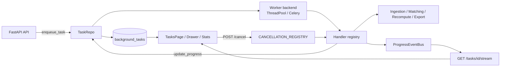
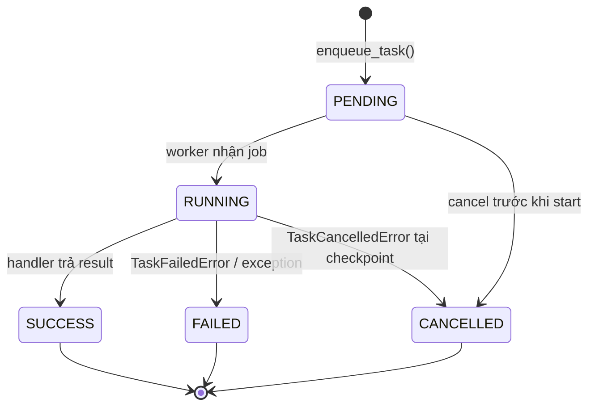

# TUẦN 9 — KIẾN TRÚC XỬ LÝ TÁC VỤ BẤT ĐỒNG BỘ (ASYNC TASK QUEUE + SSE)

> **Đồ án tốt nghiệp:** Hệ thống Quản lý và Chuẩn hóa Hồ sơ Scopus ICTU
> **Tuần:** 9/10 — Background Task Queue, SSE Realtime & Async UI
> **Ngày thực hiện:** 27/09/2026
> **Sinh viên:** Trương Quang Huy — MSSV: DTC235200899 — Lớp: CN CNTT K22A
> **Giảng viên hướng dẫn:** TS. Nguyễn Thế Vinh — Bộ môn Công nghệ phần mềm, Khoa Công nghệ thông tin (ICTU — vinhnt@ictu.edu.vn)
> **Trạng thái:** ✅ Hoàn thành — 262/262 pytest PASS, `npm run build` 0 lỗi

---

## §1. TỔNG QUAN KẾT QUẢ TUẦN 9

### 1.1. Mục tiêu Tuần 9

Tuần 9 chuyển toàn bộ **tác vụ có chi phí lớn** sang mô hình **Background Task
Queue** để HTTP request không bị block (NFR-06), đồng thời cung cấp khả năng
**giám sát tiến độ realtime**:

1. **Async Task Manager (NFR-06):**
   - Bảng `background_tasks` + `TaskRepo` quản lý vòng đời tác vụ.
   - Handler registry tách logic nghiệp vụ khỏi backend worker.
   - Worker backend thay thế được: `threadpool` (local/SQLite) ↔ `celery` (production).
2. **Enqueue bất đồng bộ cho 4 luồng nghiệp vụ:**
   - `CSV_INGESTION` — `POST /api/v1/uploads/task` (202 + `task_id`).
   - `MATCHING_PIPELINE` — `POST /api/v1/pipeline/process-batch/{batch_id}` (202).
   - `AUTO_RECOMPUTE` — `POST /api/v1/pipeline/recompute-pending/async` (202, Admin).
   - `BULK_EXPORT` — `POST /api/v1/exports/task` (202) + tải file kết quả qua
     `GET /api/v1/exports/task/{task_id}/download`.
3. **Giám sát & điều khiển:**
   - `GET /api/v1/tasks`, `GET /api/v1/tasks/{task_id}`,
     `GET /api/v1/tasks/stats/summary`, `POST /api/v1/tasks/{task_id}/cancel`.
   - `GET /api/v1/tasks/{task_id}/stream` — SSE realtime (`snapshot/progress/status/ping/close`).
   - **Cancel cooperative**: worker kiểm tra cancellation flag tại checkpoint,
     không kill thread cưỡng bức (giữ tính toàn vẹn dữ liệu).
4. **Frontend Async UX:**
   - `TasksPage` (filter + phân trang + KPI) và `TaskProgressDrawer` (SSE realtime).
   - Badge số tác vụ đang chạy trên Navbar, toast thông báo khi task kết thúc.
   - Upload CSV / kích hoạt pipeline / xuất báo cáo / dashboard đều chạy theo
     mô hình "enqueue → theo dõi → tải kết quả".

### 1.2. Kết quả tổng hợp

| Hạng mục | Trước (Tuần 8) | Sau (Tuần 9) | Ghi chú |
|---|---|---|---|
| Pytest tests | 213 | **262** | +49 test cases |
| Endpoint mới cho task queue | 0 | **9** | enqueue, monitor, cancel, SSE, stats, download |
| Frontend build errors | 0 | **0** | `vite build` PASS |
| Bundle main (`index-*.js`) | 16.3 KB | 37.2 KB | Thêm `TaskMonitorProvider` + `ToastProvider` vào app shell (vẫn << NFR 500 KB) |
| Trang `TasksPage` (lazy chunk) | 0 | 16.3 KB | Lazy-load, không tăng bundle ban đầu |
| Thời gian phản hồi enqueue | chờ đến khi xong | **< 200 ms (202)** | Upload/pipeline/export không còn giữ kết nối |

### 1.3. Bảng thay đổi file chính

**Backend**

| File | Loại | Mô tả |
|---|---|---|
| `backend/app/models/__init__.py` | Modify | Bảng `scopus_ictu.background_tasks` + 7 CHECK + 3 index (`idx_bg_status_created`, `idx_bg_type_status`, `idx_bg_actor`) |
| `backend/app/schemas/tasks.py` | Create | DTO: `TaskItem`, `TaskListResponse`, `TaskCounters`, `TaskTypeStat`, `TaskStatsResponse`, `TaskEnqueueAck`, `TaskCancelAck` |
| `backend/app/services/task_manager.py` | Create | `TaskType`/`TaskStatus`, `TaskRepo`, `CANCELLATION_REGISTRY`, `ProgressEventBus` (+ Redis pub/sub), backend `threadpool`/`celery`, `enqueue_task`, `cancel_task`, `update_progress`, `wait_for_task` |
| `backend/app/services/task_handlers.py` | Create | Handler registry: `CSV_INGESTION`, `MATCHING_PIPELINE`, `AUTO_RECOMPUTE`, `BULK_EXPORT` (+ 3 handler test) |
| `backend/app/api/v1/tasks.py` | Create | 5 endpoint: list, detail, cancel, stats, SSE stream (`?token=` cho EventSource) |
| `backend/app/api/v1/uploads.py` | Modify | `POST /uploads/task` — lưu file rồi enqueue `CSV_INGESTION` (202) |
| `backend/app/api/v1/pipeline.py` | Modify | `POST /process-batch/{batch_id}` trả `TaskEnqueueAck` (validation 404/400 trước khi queue) + `POST /recompute-pending/async` |
| `backend/app/api/v1/exports.py` | Modify | `POST /exports/task` (enqueue) + `GET /exports/task/{task_id}/download` (404/403/409/410) |
| `backend/app/core/config.py` | Modify | `EXPORT_DIR`, `EXPORT_RETENTION_HOURS`, `TASK_SSE_KEEPALIVE_SECONDS` |
| `backend/app/api/v1/__init__.py` | Modify | Đăng ký `tasks.router` |
| `backend/tests/test_tasks.py` | Create | **40 test cases**: enqueue, progress, cancel, RBAC, API list/detail/cancel, SSE, stats, SSE token auth, CSV ingestion async |
| `backend/tests/test_exports.py` | Modify | Thêm lớp `TestBulkExportTaskAPI` (**9 test cases**): enqueue, download, 403/404/409/410, end-to-end |

**Frontend**

| File | Loại | Mô tả |
|---|---|---|
| `frontend/src/contexts/TaskMonitorContext.jsx` | Create | Nguồn dữ liệu duy nhất cho task: track/un-track (persist `localStorage`), polling fallback 2.5s, stats 5s, toast khi task kết thúc, cancel/retry/download |
| `frontend/src/contexts/ToastContext.jsx` | Create | Toast provider (success/error/warning/info) dùng cho luồng async |
| `frontend/src/hooks/useTaskStream.js` | Create | Hook `EventSource` cho SSE, tự `close()` khi nhận event `close` |
| `frontend/src/components/TaskProgressDrawer.jsx` | Rewrite | Panel realtime: progress bar, badges, hủy/chạy lại/tải file, thu gọn thành pill, trạng thái rỗng |
| `frontend/src/components/TaskStatusBadge.jsx` | Create | `TaskStatusBadge` / `TaskTypeBadge` / `TaskProgressBar` dùng chung |
| `frontend/src/components/BackgroundTasksCard.jsx` | Create | Thẻ tác vụ nền trên Dashboard (counters + task đang chạy) |
| `frontend/src/pages/TasksPage.jsx` | Rewrite | 5 thẻ KPI, bảng hiệu năng theo loại, filter (loại/trạng thái/actor_id), phân trang server-side, auto-refresh 3s, modal chi tiết có tiến độ live |
| `frontend/src/pages/DashboardPage.jsx` | Modify | Thêm `BackgroundTasksCard` + tự làm mới 30s |
| `frontend/src/pages/UploadDashboard.jsx` | Modify | Toggle "Nhập chạy nền" + thẻ kết quả enqueue (tiến độ + bảng tổng hợp sau khi xong) |
| `frontend/src/pages/PublicationsPage.jsx` | Modify | Hiển thị `MATCHING_PIPELINE` task theo batch + theo dõi realtime |
| `frontend/src/pages/ExportPage.jsx` | Modify | Panel "Xuất báo cáo chạy nền" (chọn định dạng + tải file khi SUCCESS) |
| `frontend/src/components/Navbar.jsx` | Modify | Badge số tác vụ đang chạy + nút mở panel theo dõi |
| `frontend/src/api/client.js` | Modify | `tasksApi` (list/get/cancel/stats/stream), `uploadApi.uploadCsvAsync`, `exportsApi.exportBulkTask`/`downloadBulkTask`, `recomputeApi.triggerAsync`, helpers `apiUrl`/`getAccessToken`/`describeApiError` |
| `frontend/src/utils/format.js` | Create | Metadata trạng thái/loại task, format thời gian/thời lượng/số liệu |
| `frontend/src/utils/download.js` | Create | Lưu blob + đọc `Content-Disposition` (hỗ trợ `filename*=UTF-8''`) |
| `frontend/src/main.jsx` | Modify | Bọc `ToastProvider` → `AuthProvider` → `TaskMonitorProvider` |


---

## §2. KIẾN TRÚC BACKGROUND WORKER VÀ STATE MACHINE

### 2.1. Sơ đồ tổng quan



### 2.2. Vòng đời trạng thái (State Machine)



| Trạng thái | Ý nghĩa | Cờ trong UI |
|---|---|---|
| `PENDING` | Đã ghi DB, chưa có worker nhận | Vàng, có thể hủy |
| `RUNNING` | Worker đang chạy, progress được throttle ghi DB | Xanh, hiển thị realtime |
| `SUCCESS` | Hoàn tất, kết quả ở `result_json` | Xanh lá, có thể tải file |
| `FAILED` | Lỗi nghiệp vụ/hệ thống, chi tiết ở `error_message` + `result_json` | Đỏ, có thể chạy lại |
| `CANCELLED` | Người dùng hủy, worker dừng tại checkpoint an toàn | Xám |

`task_id` và `correlation_id` là UUID (default `uuid4()`); `payload_json`/`result_json`
lưu dạng JSON; `actor_id` dùng để scope RBAC (Operator chỉ thấy task của mình).

### 2.3. Bảng `scopus_ictu.background_tasks`

| Cột | Kiểu | Ghi chú |
|---|---|---|
| `task_id` | UUID (PK) | Định danh tác vụ |
| `task_type` | VARCHAR(32) | CHECK ∈ {`CSV_INGESTION`, `MATCHING_PIPELINE`, `AUTO_RECOMPUTE`, `BULK_EXPORT`, `TEST_*`} |
| `status` | VARCHAR(16) | CHECK ∈ {`PENDING`, `RUNNING`, `SUCCESS`, `FAILED`, `CANCELLED`} |
| `progress_percent` | FLOAT | CHECK `BETWEEN 0 AND 100` |
| `total_items` / `processed_items` / `success_items` / `error_items` | INTEGER | CHECK `>= 0` |
| `payload_json` | JSONB | Tham số đầu vào (file_path, filters, batch_id, operator_id…) |
| `result_json` | JSONB | Kết quả (`total_rows`, `file_name`, `file_hash_sha256`, `download_url`…) |
| `error_message` | TEXT | Thông báo lỗi cho UI |
| `actor_id` | BIGINT FK → `users.id` | Người kích hoạt (RESTRICT) |
| `correlation_id` | UUID | Truy vết xuyên tầng log |
| `created_at` / `started_at` / `finished_at` | TIMESTAMPTZ | Tính `duration_ms` |

Chỉ mục: `idx_bg_status_created (status, created_at)`, `idx_bg_type_status (task_type, status)`,
`idx_bg_actor (actor_id)` — phục vụ list/filter/stats.

### 2.4. Thành phần worker

| Thành phần | Vai trò |
|---|---|
| `TaskRepo` | CRUD thuần trên `background_tasks`: `create`, `mark_running`, `update_progress`, `mark_success`, `mark_failed`, `mark_cancelled` |
| `HANDLER_REGISTRY` | Ánh xạ `task_type` → callable `(ctx, payload) -> dict`; thêm loại task mới không cần sửa API |
| `TaskContext` | API cho handler: `update_progress`, `check_cancelled`, `db`, `task_id`, `correlation_id` |
| `CANCELLATION_REGISTRY` | Bind session DB + `threading.Event` theo `task_id`; cancel là **cooperative** |
| `ProgressEventBus` | In-process pub/sub cho SSE; có adapter `RedisProgressBus` khi `TASK_PROGRESS_BACKEND=redis` |
| Worker backend | `threadpool` (mặc định, phù hợp local/SQLite) hoặc `celery` (`run_task_job` entrypoint) |

### 2.5. Cấu hình qua biến môi trường (không hard-code)

| Biến | Mặc định | Ý nghĩa |
|---|---|---|
| `TASK_BACKEND` | `threadpool` | `threadpool` \| `celery` |
| `TASK_MAX_WORKERS` | `4` | Số worker song song của ThreadPool |
| `TASK_QUEUE_MAX_SIZE` | `1000` | Giới hạn hàng đợi trong process |
| `TASK_PROGRESS_THROTTLE_MS` | `10` | Throttle ghi DB + publish event tiến độ |
| `TASK_START_DELAY_MS` | `100` | Trễ khởi động giữa các job (giảm tranh chấp SQLite) |
| `TASK_SYNC_WAIT_SECONDS` | `300` | Timeout cho chế độ đồng bộ cũ (`async_mode=false`) |
| `TASK_SSE_KEEPALIVE_SECONDS` | `15` | Chu kỳ event `ping` giữ kết nối SSE |
| `TASK_PROGRESS_BACKEND` | `inprocess` | `inprocess` \| `redis` (khi API và worker khác process) |
| `EXPORT_DIR` | `./_exports` | Thư mục chứa file do `BULK_EXPORT` sinh ra |
| `EXPORT_RETENTION_HOURS` | `72` | Thời gian giữ file export trước khi dọn (NFR-03) |


---

## §3. STREAM SỰ KIỆN THỜI GIAN THỰC BẰNG SSE

### 3.1. Endpoint & xác thực

`GET /api/v1/tasks/{task_id}/stream` — `Content-Type: text/event-stream`,
header `Cache-Control: no-cache`, `X-Accel-Buffering: no`, `Connection: keep-alive`.

`EventSource` của browser **không gửi được header**, nên endpoint nhận thêm
`?token=<access_token>` (vẫn verify chữ ký JWT + `type=access` + `user.is_active`
như bình thường). Header `Authorization: Bearer` vẫn được hỗ trợ cho client
dùng `fetch`/`curl`.

RBAC khi subscribe: Operator chỉ stream được task của mình; Admin stream được
tất cả (sai quyền → `403`, task không tồn tại → `404`).

### 3.2. Danh sách event

| Event | Khi nào gửi | Payload chính |
|---|---|---|
| `snapshot` | Ngay khi kết nối (và lần cuối trước khi đóng) | Toàn bộ `TaskItem`: `status`, `progress_percent`, counters, `actor_username`, … |
| `progress` | Mỗi lần ghi tiến độ (đã throttle 10ms) | `processed`, `total`, `progress_percent`, `message`, `ts` |
| `status` | Đổi trạng thái (`RUNNING`/`SUCCESS`/`FAILED`/`CANCELLED`) | `status`, `error`, `result`, `ts` |
| `ping` | Không có dữ liệu trong `TASK_SSE_KEEPALIVE_SECONDS` | `ts` (keepalive, chống proxy cắt kết nối) |
| `close` | Sau trạng thái terminal | `task_id`, `status` |
| `error` | Lỗi phát sinh trong generator | `message` |

Ví dụ luồng thực tế:

```text
retry: 2000

event: snapshot
data: {"task_id":"6b1f...","status":"RUNNING","progress_percent":42.5,...}

event: progress
data: {"task_id":"6b1f...","processed":127,"total":300,"progress_percent":43.1,"message":"Đã bóc tách 127/300 bài báo"}

event: status
data: {"task_id":"6b1f...","status":"SUCCESS","progress_percent":100.0,"result":{"new_rows":298}}

event: close
data: {"task_id":"6b1f...","status":"SUCCESS"}
```

### 3.3. Cơ chế đảm bảo không block & fallback

- Generator của endpoint là **sync generator**: Starlette chạy trong threadpool nên
  `sub.poll(timeout=keepalive)` không chiếm event loop → API phục vụ request khác bình thường.
- Khi worker kết thúc, stream tự `close`; client chủ động `EventSource.close()`
  trong hook `useTaskStream` để tránh reconnect vô ích.
- **Fallback polling:** nếu SSE bị proxy/hạ tầng chặn, `TaskMonitorContext` vẫn poll
  `GET /tasks/{id}` mỗi 2.5s và `GET /tasks/stats/summary` mỗi 5s → UI không bao giờ "đứng".
- Khi chạy nhiều process (Celery + nhiều API instance), chỉ cần đặt
  `TASK_PROGRESS_BACKEND=redis` để `ProgressEventBus` phát/nhận qua Redis Pub/Sub.

---

## §4. GIAO DIỆN VÀ UX

### 4.1. Kiến trúc state phía frontend

```
main.jsx
└── ToastProvider              (toast toàn cục)
    └── AuthProvider           (user hiện tại)
        └── TaskMonitorProvider   ← SSE/polling/stats/track/hủy/tải file
            └── App → Navbar (badge) + TaskProgressDrawer (panel) + Routes
```

- `TaskMonitorContext` là **nguồn dữ liệu duy nhất** cho mọi thành phần UI
  (drawer, badge Navbar, TasksPage, Dashboard card, Upload/Publications/Export).
- Danh sách "đang theo dõi" được lưu ở `localStorage`
  (`scopus_ictu_tracked_tasks`, tối đa 8 task) → **giữ nguyên sau khi F5/chuyển trang**.
- Chỉ tối đa 3 EventSource mở đồng thời (drawer) và 2 (Dashboard card) để tiết kiệm kết nối;
  các task còn lại vẫn được cập nhật qua polling.
- Khi task chuyển từ `PENDING/RUNNING` → `SUCCESS/FAILED/CANCELLED`, hệ thống phát
  **toast** đúng 1 lần (so sánh status trước/sau) và tự refresh thống kê.

### 4.2. Màn hình & thành phần

| Màn hình / Thành phần | Chức năng chính |
|---|---|
| `TasksPage` (`/tasks`) | 5 thẻ KPI (tổng, đang chạy, thành công, thất bại, đang theo dõi) + bảng hiệu năng theo loại task; filter loại/trạng thái/`actor_id`; phân trang server-side (10/20/50); auto-refresh 3s (tắt được); nút theo dõi/hủy/chạy lại/tải file/chi tiết |
| Modal chi tiết (`?task=<id>`) | Tiến độ live qua SSE, counters, `payload_json`/`result_json`, lỗi; deep-link dùng chung với drawer |
| `TaskProgressDrawer` | Panel nổi mọi trang đã đăng nhập: progress bar, badge, thời lượng, realtime indicator, hủy/chạy lại/tải file/ngừng theo dõi, thu gọn thành pill hiển thị số task |
| `BackgroundTasksCard` (Dashboard) | Counters 24h, task đang chạy (progress), tóm tắt theo loại; Dashboard tự làm mới 30s |
| `Navbar` | Badge số task đang chạy cạnh menu "Tiến trình Nền / Tasks" + nút "Tiến trình" (nhấp nháy khi có task chạy) |
| `UploadDashboard` | Toggle **"Nhập chạy nền (không chờ)"** (mặc định bật) → hiển thị thẻ "Đã đưa vào hàng đợi nền" với tiến độ, kết quả `new_rows/duplicate_rows/warning_breakdown` sau khi xong |
| `PublicationsPage` | Sau khi kích hoạt pipeline, hiển thị khối "Tác vụ nền (MATCHING_PIPELINE)" với tiến độ realtime bên cạnh tiến độ batch |
| `ExportPage` | Panel **"Xuất báo cáo chạy nền"** (chọn Excel/CSV/JSON + tạo tác vụ) và nút "Tải file kết quả" khi task `SUCCESS` |
| Toast | Thông báo enqueue/hủy/lỗi/tải file; đặc biệt hữu ích khi tác vụ kết thúc lúc người dùng đã chuyển trang |


### 4.3. Bốn luồng người dùng tiêu biểu

1. **Nhập CSV lớn không chờ (UC-01 async):** chọn/bật "Nhập chạy nền" → kéo file →
   API lưu file + trả `202 {task_id}` → drawer/„thẻ hàng đợi" hiển thị tiến độ →
   khi `SUCCESS`, kết quả nhập hiển thị dạng 4 thẻ chỉ số như đường đồng bộ.
2. **Matching pipeline:** chọn batch → "Kích hoạt bóc tách & tính Match Score" →
   `202 {task_id}` → theo dõi cả tiến độ batch (`/pipeline/status/{id}`) và task nền.
3. **Xuất báo cáo lớn:** ExportPage → "Tạo tác vụ xuất nền" → `202` → khi task
   `SUCCESS`, nút "Tải file kết quả" tải qua `/exports/task/{task_id}/download`
   (file kèm `X-File-SHA256`, `X-Row-Count` để đối soát NFR-03).
4. **Giám sát & can thiệp:** TasksPage lọc theo trạng thái `RUNNING` → xem chi tiết
   (SSE live) → nếu phát hiện batch sai, bấm **Hủy** (cooperative cancel) hoặc
   **Chạy lại** (với `BULK_EXPORT`).

---

## §5. TIÊU CHÍ NGHIỆM THU VÀ KIỂM THỬ

### 5.1. Tiêu chí nghiệm thu

| Mã | Tiêu chí | Kết quả |
|---|---|---|
| AC-9.1 | Enqueue trả UUID + trạng thái `PENDING`, không block request | ✅ 202 + `TaskEnqueueAck {task_id, stream_url}` |
| AC-9.2 | Worker chuyển `PENDING → RUNNING → SUCCESS/CANCELLED/FAILED` | ✅ Có test cho từng nhánh |
| AC-9.3 | Progress 0–100 + counters được ghi DB và publish event | ✅ `TestProgressUpdate` |
| AC-9.4 | Task thành công lưu `result_json`; task lỗi lưu `error_message` + chi tiết | ✅ `TestTaskEnqueue`, `TestAsyncCsvIngestion` |
| AC-9.5 | Cancel là cooperative, không kill thread cưỡng bức | ✅ `TestCancelTask`, `TestCancelAPI` |
| AC-9.6 | Operator chỉ thấy task của mình, Admin thấy toàn bộ | ✅ `TestRBACOperatorScope` (403 khi xem task người khác) |
| AC-9.7 | SSE trả đúng framing (`snapshot`/`close`), hỗ trợ `?token=` | ✅ `TestSSEStream`, `TestSSEQueryTokenAuth` |
| AC-9.8 | Thống kê phục vụ badge/dashboard (`/tasks/stats/summary`) | ✅ `TestTaskStatsSummary` (gồm validate `window_hours`) |
| AC-9.9 | Pipeline & recompute trả `task_id` thay vì block | ✅ `TestAsyncEndpoints` + `/recompute-pending/async` |
| AC-9.10 | Tải file `BULK_EXPORT` đúng RBAC & retention | ✅ `TestBulkExportTaskAPI` (403/404/409/410 + end-to-end) |
| AC-9.11 | Cấu hình worker không hard-code | ✅ `TASK_BACKEND`, `TASK_MAX_WORKERS`, `TASK_QUEUE_MAX_SIZE`, `TASK_PROGRESS_THROTTLE_MS`, `TASK_START_DELAY_MS`, `TASK_SSE_KEEPALIVE_SECONDS` |
| AC-9.12 | Frontend build sạch, bundle ban đầu << 500 KB | ✅ `vite build` 0 lỗi — main 37.2 KB (gzip 12.5 KB) |
| AC-9.13 | Theo dõi task không mất khi F5/chuyển trang | ✅ `TaskMonitorContext` + `localStorage` (tối đa 8 task) |

### 5.2. Kết quả chạy test

```powershell
cd backend
.venv\Scripts\python.exe -m pytest tests/test_tasks.py -q      # 40 passed
.venv\Scripts\python.exe -m pytest tests/test_exports.py -q    # 48 passed
.venv\Scripts\python.exe -m pytest -q                          # 262 passed
```

Kết quả ghi nhận trong `junitxml`: **tests=262, failures=0, errors=0, skipped=0**
(thời gian ~112s). So với Tuần 8 (213 test) bổ sung **49 test cases**:

- `tests/test_tasks.py` (mới): `TestTaskEnqueue`, `TestProgressUpdate`, `TestCancelTask`,
  `TestTasksAPI`, `TestCancelAPI`, `TestRBACOperatorScope`, `TestSSEStream`,
  `TestAsyncEndpoints`, `TestTaskStatsSummary`, `TestSSEQueryTokenAuth`, `TestAsyncCsvIngestion`.
- `tests/test_exports.py::TestBulkExportTaskAPI` (mới): 9 test cases cho luồng xuất nền.

```powershell
cd frontend
npm run build    # ✓ built — 0 lỗi
```

### 5.3. Hạn chế & hướng phát triển (Tuần 10+)

- Event bus mặc định là in-process: chạy nhiều worker/instance cần
  `TASK_PROGRESS_BACKEND=redis` (adapter đã có, chưa bật mặc định).
- Chưa có scheduler cho task định kỳ (cron) và chưa có retry policy tự động —
  hiện người dùng bấm "Chạy lại" cho `BULK_EXPORT`.
- `MAX_TRACKED = 8` ở frontend: nếu cần theo dõi nhiều task hơn nên chuyển sang
  trang `TasksPage` (filter + phân trang) thay vì panel.
- Dọn file export theo `EXPORT_RETENTION_HOURS` đang thực hiện lazy lúc tải file;
  Tuần 10 có thể thêm job dọn định kỳ.

